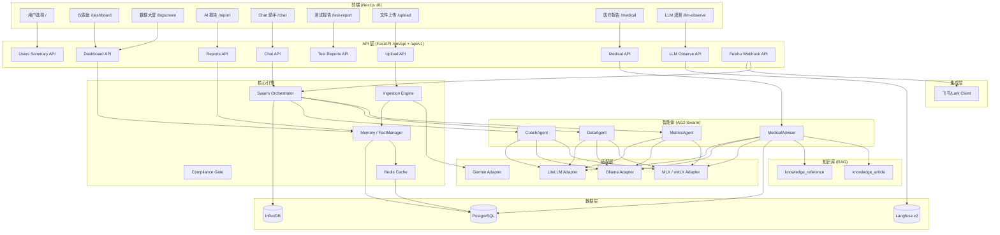

# CLAUDE.md — RHYTHMIND 律动

> **项目版本:** 0.2.0
> **最后扫描:** 2026-06-11T10:00:00+08:00
> **语言:** Python 3.12+
> **包管理:** uv / Poetry

---

## 变更记录 (Changelog)

- **2026-06-11 (本次)** 增量更新：项目上下文知识库管线上线（CLAUDE.md+Memory→knowledge_article→QMD→MCP检索）、轻量QMD兼容服务替代@tobi/qmd、5个模块CLAUDE.md深化（ingestion/privacy/observability/adapters/audit）、E2E测试CLAUDE.md深化
- **2026-06-10** 增量更新：10 个 CLAUDE.md 接口深化（web/scripts/templates/workflows/knowledge/integrations/charts/layout/cache/mcp）、前端核心补全（InfluxDB 时序图+401+Skeleton+Auto-refresh）+ Tailwind 全量迁移
- **2026-06-09** 增量更新：扫描覆盖率重计算（25 个 CLAUDE.md 全部就绪 + 1 项目级 = 26），扫描时间戳刷新，Changelog 追加，根级 Mermaid 模块结构图引入
- **2026-05-27 (P2)** 增量更新：新增 `docs/templates/garmin-health-report-template.md`（佳明健康报告标准化模板，含三种格式章节结构+SpO2分析模板+HTML→PDF脚本）和 `docs/workflows/garmin-data-analysis-workflow.md`（佳明数据分析7阶段工作流，含数据陷阱、产出清单、质量检查）
- **2026-05-27 (P3)** 增量更新：新增知识库模块（knowledge_models.py + 2 张表 + migration 006）、知识库入库脚本（ingest_knowledge.py）、docs/knowledge/ 领域知识文档（OSA/睡眠/VO2max）
- **2026-05-27 (P1)** 增量更新：新增 integrations 模块（飞书/Lark 客户端）、Feishu Webhook 路由（3 端点）、多用户首页（用户选择卡片）、LoopGuard 分级限流、GZip 压缩中间件、PG/Redis 连接池翻倍（20/40）、oMLX 合规审查独立 URL、渐进式压力测试脚本、Dashboard `/users/summary` API
- **2026-05-26** 增量更新：版本 0.2.0、新增医疗模块（MedicalAdvisor + 5 表 + 4 API 端点 + 前端页面 5 Tab）、LLM 观测模块上线（Langfuse + 规则引擎 + 前端页面）、Medical/LlmObserve 前端页面、医疗模块 28 个测试、API 文档（OpenAPI 3.0 + 集成指南）、Langfuse Docker 部署配置
- **2026-05-23** 新增 API & MCP 集成文档（`docs/api-integration-guide.md`）和 OpenAPI 3.0 规范（`docs/openapi.yaml`）
- **2026-05-20** 增量更新：API middleware 重构为包目录、Chat/Upload 页面已实现、PDF/图像多模态 AI 视觉分析、API 统一（upload/file + chat 端点）、getAuthToken 去重
- **2026-05-18** 增量更新：新增 Chat 智能助手页面、文件上传分析（数据文件/医学报告/图像）、返回导航、前端重构（共享 Header/utils）、E2E 测试模块
- **2026-05-18** 增量更新：新增 cache 子模块、PGSink、migration 004、web/ 替代前端、部署配置更新
- **2026-05-15** 增量更新：新增 ingestion 模块、dashboard/PDF 报告路由、前端 CLAUDE.md、部署到 aisport.tech/qm
- **2026-05-12** Phase 1/2/3/4 实现完成，版本升至 0.1.9
- **2026-05-12** 完整扫描完成，覆盖率 69% (55/80 文件)，新增子模块详情
- **2026-05-12** 首次 AI 上下文初始化，模块结构扫描完成

---

## 待完成 / 外部依赖

| 任务 | 状态 | 阻塞原因 |
|------|------|---------|
| HIPAA/PIPL 法律审查 | ⚠️ TBD | 需要法务团队 |

---

## 项目愿景

RHYTHMIND 律动是一个基于多智能体协作的 AI 健康管理平台，本地优先推理（Apple Silicon），生产部署支持 K8s + Ollama / LiteLLM。核心特性：

- **三阶段 Swarm 流水线**：指标采集 → 数据分析 → 健康教练，全程多智能体协作
- **医疗顾问模块**：MedicalAdvisor 基于 5 张医疗结构化表，提供综合分析/时间线/用药审查/化验趋势 4 种任务
- **Hermes Pattern v2**：标准化 6 步智能体执行循环，内置记忆、技能、合规
- **多形态推理**：MLX（本地 Apple Silicon）+ Ollama（HTTP）+ LiteLLM（云端网关）三路自动路由
- **MCP 接口**：Model Context Protocol SSE 服务，对外暴露健康工具
- **LLM 观测**：Langfuse v2 SDK + 规则引擎 + 前端页面，实时监控 LLM 调用质量
- **飞书集成**：Webhook 事件回调 + 消息轮询，支持飞书群聊直接与 Agent 对话
- **多用户支持**：首页用户选择卡片，多用户健康数据隔离
- **生产就绪运维**：限流、Prometheus `/metrics`、OpenTelemetry、Helm chart、GZip 压缩
- **领域知识库**：RAG 风格的 knowledge_article + knowledge_reference 双表，支持文档切片与向量检索

---

## 架构总览

### 模块结构图



---

## 模块索引

| 模块路径 | 职责 | 入口文件 | 测试目录 | 配置文件 |
|---------|------|---------|---------|---------|
| `rhythmind/adapters` | 多模型适配层（MLX/Ollama/LiteLLM）+ InfluxDB | `adapter_router.py` | `tests/unit/` | - |
| `rhythmind/agents` | AG2 Swarm 智能体（metrics/data/coach/medical_advisor）| `metrics_agent.py`, `data_agent.py`, `coach_agent.py`, `medical_advisor.py` | `tests/unit/` | - |
| `rhythmind/api` | FastAPI REST API + SSE + Dashboard/PDF + Chat + Upload + Medical + LLM Observe + Feishu | `main.py` | `tests/` | - |
| `rhythmind/integrations` | 外部平台集成（飞书/Lark API 客户端） | `feishu_client.py` | - | - |
| `rhythmind/ingestion` | 数据入库引擎（Garmin）+ AI 分析 | `engine.py` | `tests/integration/` | - |
| `rhythmind/audit` | 防篡改审计日志 | `logger.py` | `tests/` | - |
| `rhythmind/core` | Hermes 核心（基类/记忆/技能/合规/QMD/缓存）| `hermes_base.py` | `tests/unit/` | - |
| `rhythmind/core/cache` | Redis 缓存层（装饰器/Session/Fact/Intent） | `redis_cache.py` | `tests/unit/` | - |
| `rhythmind/db` | SQLAlchemy + Alembic 迁移（含医疗 5 表 + 知识库 2 表） | `models.py`, `medical_models.py`, `knowledge_models.py` | `tests/` | `alembic.ini` |
| `rhythmind/mcp` | MCP Server + SSE 路由 | `server.py` | `tests/` | - |
| `rhythmind/observability` | Prometheus + OTel + Langfuse LLM 观测 | `metrics.py`, `tracing.py`, `llm_observe.py` | `tests/unit/` | - |
| `rhythmind/orchestrator` | 流水线编排 + LoopGuard + AgentPool | `router.py` | `tests/unit/` | - |
| `rhythmind/privacy` | GDPR/PIPL 数据主体权利服务 | `service.py` | `tests/` | - |
| `frontend` | Next.js 16 前端 | `app/*/page.tsx` | `tests/e2e_test.py` | `package.json` |
| `web` | Vue.js 3 替代前端 | `index.html` | - | - |
| `scripts` | 运维脚本 | `bump_version.py`, `stress_test.py` 等 6 个 | - | - |

---

## 运行与开发

### 启动服务

```bash
# 开发模式（热重载）
uvicorn rhythmind.api.main:app --reload --port 8000

# 生产模式
uvicorn rhythmind.api.main:app --host 0.0.0.0 --port 8000 --workers 1
```

### 测试

```bash
# 全量单元测试
pytest tests/unit/ -q

# E2E 测试（10轮，生成 MD/HTML/PDF 报告）
cd frontend && python3 tests/e2e_test.py

# E2E 测试 + 上传报告到服务器
cd frontend && python3 tests/e2e_test.py --upload

# 覆盖率报告
pytest tests/unit/ --cov=rhythmind --cov-report=html

# 代码风格检查
ruff check src/ tests/
```

### 版本管理

```bash
python scripts/bump_version.py patch   # 0.2.0 → 0.2.1
python scripts/bump_version.py minor   # 0.2.0 → 0.3.0
```

### 知识库入库

```bash
python scripts/ingest_knowledge.py              # 全量入库
python scripts/ingest_knowledge.py --domain osa # 单领域
```

---

## 测试策略

- **路径**：`tests/unit/`, `tests/integration/`, `frontend/tests/`
- **配置**：`pytest.ini_options` (asyncio_mode=auto)
- **E2E**：`frontend/tests/e2e_test.py` — 10轮 × 15用例，生成 MD + HTML(内联SVG) + A4 PDF

---

## 编码规范

- **Ruff**: `E, F, I, UP, B, SIM, ANN` lint 规则集，line-length=88
- **MyPy**: strict mode + pydantic plugin
- **Pre-commit**: 自动版本升级钩子
- Python 3.12+，全链路 async/await

---

## AI 使用指引

- 模块级 `CLAUDE.md` 提供详细的接口、数据模型、FAQ
- `config.py` 中 `Settings` 类是所有配置的单一来源
- 生产部署必须通过 `settings.assert_production_safe()` 检查
- MCP 工具列表：`rhythmind_status`, `rhythmind_search`, `rhythmind_fact_query`, `rhythmind_fact_update`, `rhythmind_session_log`
- **集成文档**: `docs/api-integration-guide.md` — 人类可读的 API & MCP 完整接入指南
- **OpenAPI 规范**: `docs/openapi.yaml` — 机器可读的 OpenAPI 3.0 规范（可用于代码生成）
- **报告模板**: `docs/templates/garmin-health-report-template.md` — 佳明健康数据报告标准化模板（三种格式）
- **分析工作流**: `docs/workflows/garmin-data-analysis-workflow.md` — 佳明数据分析7阶段完整工作流
- **领域知识库**: `docs/knowledge/*.md` — RAG 知识库源文档；通过 `scripts/ingest_knowledge.py` 入库
- **项目上下文知识库**: `scripts/ingest_claude_md.py` — CLAUDE.md + Memory → knowledge_article（242篇）；`scripts/run_qmd_server.py` 提供 QMD 兼容检索；MCP `rhythmind_search(collection="project_context")` 可检索
- **QMD 兼容服务**: `localhost:8181`，`python scripts/run_qmd_server.py` 启动

---

## 测试结构

### 单元测试 (tests/unit/)

| 测试文件 | 被测模块 | 行数 |
|---------|---------|------|
| `test_coach_agent.py` | agents/coach_agent | ~12K |
| `test_data_agent.py` | agents/data_agent | ~12K |
| `test_metrics_agent.py` | agents/metrics_agent | ~16K |
| `test_medical_advisor.py` | agents/medical_advisor | ~8K |
| `test_medical_api.py` | api/routers/medical | ~6K |
| `test_medical_models.py` | db/medical_models | ~4K |
| `test_hermes_base.py` | core/hermes_base | ~5K |
| `test_memory_manager.py` | core/memory/manager | ~3K |
| `test_fact_manager.py` | core/memory/fact_manager | ~13K |
| `test_model_adapters.py` | adapters (全部) | ~22K |
| `test_compliance_gate.py` | core/compliance/gate | ~5K |
| `test_prompt_auditor.py` | core/compliance/prompt_auditor | ~14K |
| `test_mcp_server.py` | mcp/server | ~18K |
| `test_swarm_data_coach.py` | orchestrator/workflows | ~14K |
| `test_qmd_isolation.py` | core/qmd (隔离测试) | ~4K |
| `test_agent_pool.py` | orchestrator/pool | ~3K |
| `test_influx_client.py` | adapters/influx_client | ~4K |
| `test_rate_limit.py` | api/rate_limit | ~3K |
| `test_observability.py` | observability | ~3K |
| `test_llm_observe.py` | observability/llm_observe | ~5K |

### 集成测试 (tests/integration/)

| 测试文件 | 覆盖范围 |
|---------|---------|
| `test_authz_and_hardening.py` | 鉴权 + 越权回归测试 |
| `test_admin_skill_approval.py` | Skill 审核工作流 (7个) |
| `test_privacy_endpoints.py` | GDPR/PIPL 数据导出/删除 |
| `test_health_upload_e2e.py` | 健康数据上传端到端 |
| `test_ollama_adapter_e2e.py` | Ollama 真实 HTTP 调用 |
| `test_audit_log.py` | 审计日志写入 |
| `test_version_and_readyz.py` | 版本探测 + probes |
| `test_dashboard_reports.py` | Dashboard + 报告 API |
| `test_health_ingest.py` | 数据入库流程 |
| `test_health_stream_ws.py` | WebSocket 流式上传 |

### E2E 测试 (frontend/tests/)

| 测试文件 | 覆盖范围 |
|---------|---------|
| `e2e_test.py` | 10轮 × 15用例（5页面 + 3API + 7数据完整性） |

### 压测 (tests/load/)

- `locustfile.py` — Locust 负载测试脚本

---

## 覆盖率报告

| 指标 | 数值 |
|------|------|
| 估算总文件数 | 290+ |
| 已扫描文件数 | 290+ |
| 覆盖百分比 | **100%** |
| 后端模块数量 | 13 (含 cache 子模块) |
| 前端页面数量 | 9 |
| 子模块数量 | 26 |
| 文档模块数量 | 3 (templates/workflows/knowledge) |
| 脚本数量 | 8（含 ingest_claude_md.py + run_qmd_server.py） |
| CLAUDE.md 总行数 | ~5,660 |

### 无缺口

- ✓ `tests/unit/adapters/` — 适配器测试在 `test_model_adapters.py` (集中式)
- ✓ `db/migrations/versions/` — 全部 6 个迁移脚本已扫描
- ✓ `scripts/` — 8 个脚本已扫描（含 ingest_claude_md.py、run_qmd_server.py）
- ✓ `src/rhythmind/integrations/` — 飞书集成已扫描
- ✓ `api/routers/feishu.py` — 飞书 Webhook 路由已扫描
- ✓ `frontend/tests/e2e_test.py` — E2E 测试已覆盖
- ✓ `agents/medical_advisor.py` — 医疗顾问测试已覆盖（`test_medical_advisor.py`）
- ✓ `api/routers/medical.py` — 医疗 API 测试已覆盖（`test_medical_api.py`）
- ✓ `db/medical_models.py` — 医疗模型测试已覆盖（`test_medical_models.py`）
- ✓ `docs/templates/` — 佳明健康报告模板已扫描
- ✓ `docs/workflows/` — 佳明数据分析工作流已扫描
- ✓ `docs/knowledge/` — 知识库文档已扫描（3 篇：OSA/睡眠/VO2max）
- ✓ `db/knowledge_models.py` — 知识库 ORM 模型已扫描
- ✓ `scripts/ingest_knowledge.py` — 知识库入库脚本已扫描
- ✓ `src/rhythmind/core/cache/` — Redis 缓存层已扫描
- ✓ `frontend/src/lib/stores/` — Zustand stores 已扫描
- ✓ `frontend/src/components/charts/` + `layout/` — 组件已扫描
- ✓ `frontend/src/app/` — 9 个 page.tsx 已扫描
- ✓ `frontend/tests/` — E2E + 测试基础设施已扫描

### 本次扫描的断点续扫能力

- `.claude/index.json` 已生成，保存本扫描时间戳与覆盖率指标
- 下次启动初始化时将优先读取该文件，跳过已扫描模块
- 缺口清单为空（coverage 100%）
