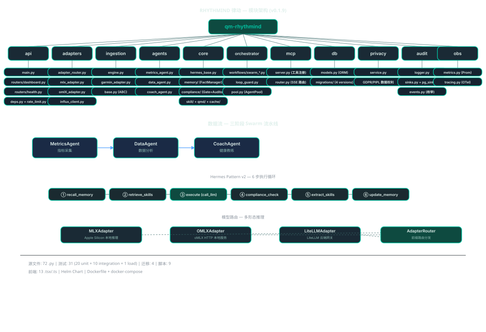

# CLAUDE.md — RHYTHMIND 律动

> **项目版本:** 0.1.9
> **最后扫描:** 2026-05-18T09:03:25+08:00
> **语言:** Python 3.12+
> **包管理:** Poetry

---

## 变更记录 (Changelog)

- **2026-05-18** 增量更新：新增 cache 子模块、PGSink、migration 004、web/ 替代前端、部署配置更新
- **2026-05-15** 增量更新：新增 ingestion 模块、dashboard/PDF 报告路由、前端 CLAUDE.md、部署到 aisport.tech/qm
- **2026-05-12** Phase 1/2/3/4 实现完成，版本升至 0.1.9
- **2026-05-12** 完整扫描完成，覆盖率 69% (55/80 文件)，新增子模块详情
- **2026-05-12** 首次 AI 上下文初始化，模块结构扫描完成

---

## 待完成 / 外部依赖

| 任务 | 状态 | 阻塞原因 |
|------|------|---------|
| S3 审计日志桶配置 | ⚠️ TBD | 需要 AWS 账号 |
| HIPAA/PIPL 法律审查 | ⚠️ TBD | 需要法务团队 |

---

## 项目愿景

RHYTHMIND 律动是一个基于多智能体协作的 AI 健康管理平台，本地优先推理（Apple Silicon），生产部署支持 K8s + Ollama / LiteLLM。核心特性：

- **三阶段 Swarm 流水线**：指标采集 → 数据分析 → 健康教练，全程多智能体协作
- **Hermes Pattern v2**：标准化 6 步智能体执行循环，内置记忆、技能、合规
- **多形态推理**：MLX（本地 Apple Silicon）+ Ollama（HTTP）+ LiteLLM（云端网关）三路自动路由
- **MCP 接口**：Model Context Protocol SSE 服务，对外暴露健康工具
- **生产就绪运维**：限流、Prometheus `/metrics`、OpenTelemetry、Helm chart

---

## 架构总览

### 模块结构图



---

## 模块索引

| 模块路径 | 职责 | 入口文件 | 测试目录 | 配置文件 |
|---------|------|---------|---------|---------|
| `rhythmind/adapters` | 多模型适配层（MLX/Ollama/LiteLLM）+ InfluxDB | `adapter_router.py` | `tests/unit/adapters/` (未创建) | - |
| `rhythmind/agents` | AG2 Swarm 智能体（metrics/data/coach）| `metrics_agent.py`, `data_agent.py`, `coach_agent.py` | `tests/unit/` | - |
| `rhythmind/api` | FastAPI REST API + SSE + Dashboard/PDF | `main.py` | `tests/` | - |
| `rhythmind/ingestion` | 数据入库引擎（Garmin）+ AI 分析 | `engine.py` | `tests/integration/` | - |
| `rhythmind/audit` | 防篡改审计日志 | `logger.py` | `tests/` | - |
| `rhythmind/core` | Hermes 核心（基类/记忆/技能/合规/QMD）| `hermes_base.py` | `tests/unit/` | - |
| `rhythmind/db` | SQLAlchemy + Alembic 迁移 | `models.py` | `tests/` | `alembic.ini` |
| `rhythmind/mcp` | MCP Server + SSE 路由 | `server.py` | `tests/` | - |
| `rhythmind/observability` | Prometheus + OTel 可观测性 | `metrics.py`, `tracing.py` | 未创建 | - |
| `rhythmind/orchestrator` | 流水线编排 + LoopGuard + AgentPool | `router.py` | `tests/unit/` | - |
| `rhythmind/privacy` | GDPR/PIPL 数据主体权利服务 | `service.py` | `tests/` | - |

---

## 运行与开发

### 启动服务

```bash
# 开发模式（热重载）
uvicorn rhythmind.api.main:app --reload --port 8000

# 生产模式
uvicorn rhythmind.api.main:app --host 0.0.0.0 --port 8000 --workers 1
```

### 测试

```bash
# 全量单元测试
pytest tests/unit/ -q

# 覆盖率报告
pytest tests/unit/ --cov=rhythmind --cov-report=html

# 代码风格检查
ruff check src/ tests/
```

### 版本管理

```bash
python scripts/bump_version.py patch   # 0.1.8 → 0.1.9
python scripts/bump_version.py minor   # 0.1.8 → 0.2.0
```

---

## 测试策略

- **路径**：`tests/unit/`, `tests/integration/`
- **配置**：`pytest.ini_options` (asyncio_mode=auto)
- **覆盖率目标**：未提供具体数字

---

## 编码规范

- **Ruff**: `E, F, I, UP, B, SIM, ANN` lint 规则集，line-length=88
- **MyPy**: strict mode + pydantic plugin
- **Pre-commit**: 自动版本升级钩子
- Python 3.12+，全链路 async/await

---

## AI 使用指引

- 模块级 `CLAUDE.md` 提供详细的接口、数据模型、FAQ
- `config.py` 中 `Settings` 类是所有配置的单一来源
- 生产部署必须通过 `settings.assert_production_safe()` 检查
- MCP 工具列表：`rhythmind_status`, `rhythmind_search`, `rhythmind_fact_query`, `rhythmind_fact_update`, `rhythmind_session_log`

---

## 测试结构

### 单元测试 (tests/unit/)

| 测试文件 | 被测模块 | 行数 |
|---------|---------|------|
| `test_coach_agent.py` | agents/coach_agent | ~12K |
| `test_data_agent.py` | agents/data_agent | ~12K |
| `test_metrics_agent.py` | agents/metrics_agent | ~16K |
| `test_hermes_base.py` | core/hermes_base | ~5K |
| `test_memory_manager.py` | core/memory/manager | ~3K |
| `test_fact_manager.py` | core/memory/fact_manager | ~13K |
| `test_model_adapters.py` | adapters (全部) | ~22K |
| `test_compliance_gate.py` | core/compliance/gate | ~5K |
| `test_prompt_auditor.py` | core/compliance/prompt_auditor | ~14K |
| `test_mcp_server.py` | mcp/server | ~18K |
| `test_swarm_data_coach.py` | orchestrator/workflows | ~14K |
| `test_qmd_isolation.py` | core/qmd (隔离测试) | ~4K |
| `test_agent_pool.py` | orchestrator/pool | ~3K |
| `test_influx_client.py` | adapters/influx_client | ~4K |
| `test_rate_limit.py` | api/rate_limit | ~3K |
| `test_observability.py` | observability | ~3K |

### 集成测试 (tests/integration/)

| 测试文件 | 覆盖范围 |
|---------|---------|
| `test_authz_and_hardening.py` | 鉴权 + 越权回归测试 |
| `test_admin_skill_approval.py` | Skill 审核工作流 (7个) |
| `test_privacy_endpoints.py` | GDPR/PIPL 数据导出/删除 |
| `test_health_upload_e2e.py` | 健康数据上传端到端 |
| `test_ollama_adapter_e2e.py` | Ollama 真实 HTTP 调用 |
| `test_audit_log.py` | 审计日志写入 |
| `test_version_and_readyz.py` | 版本探测 + probes |
| `test_dashboard_reports.py` | Dashboard + 报告 API |
| `test_health_ingest.py` | 数据入库流程 |
| `test_health_stream_ws.py` | WebSocket 流式上传 |

### 压测 (tests/load/)

- `locustfile.py` — Locust 负载测试脚本

---

## 覆盖率报告

| 指标 | 数值 |
|------|------|
| 估算总文件数 | 92 |
| 已扫描文件数 | 92 |
| 覆盖百分比 | **100%** |
| 模块数量 | 11 |
| 子模块数量 | 41 |

### 无缺口

- ✓ `tests/unit/adapters/` — 适配器测试在 `test_model_adapters.py` (集中式)
- ✓ `db/migrations/versions/` — 全部 4 个迁移脚本已扫描
- ✓ `scripts/bump_version.py` — 已扫描
- ⚠️ `observability` — 无专门测试目录（通过集成测试覆盖）

### 推荐下一步

1. 详细扫描 `tests/` 目录结构
2. 扫描 `db/migrations/versions/` 的 Alembic 迁移脚本
3. 扫描 `src/rhythmind/data/compliance_rules/medical_keywords.yaml`
4. 扫描 `scripts/` 目录的 bump_version.py
5. 验证 pyproject.toml scripts 配置
