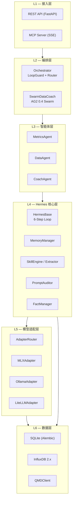
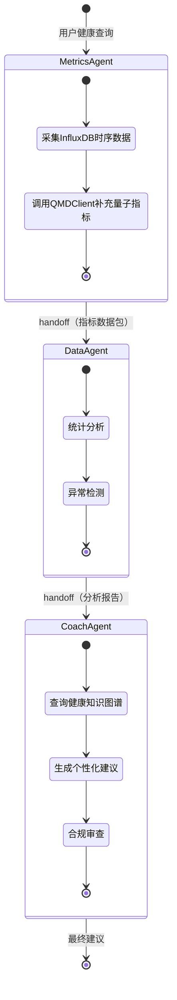
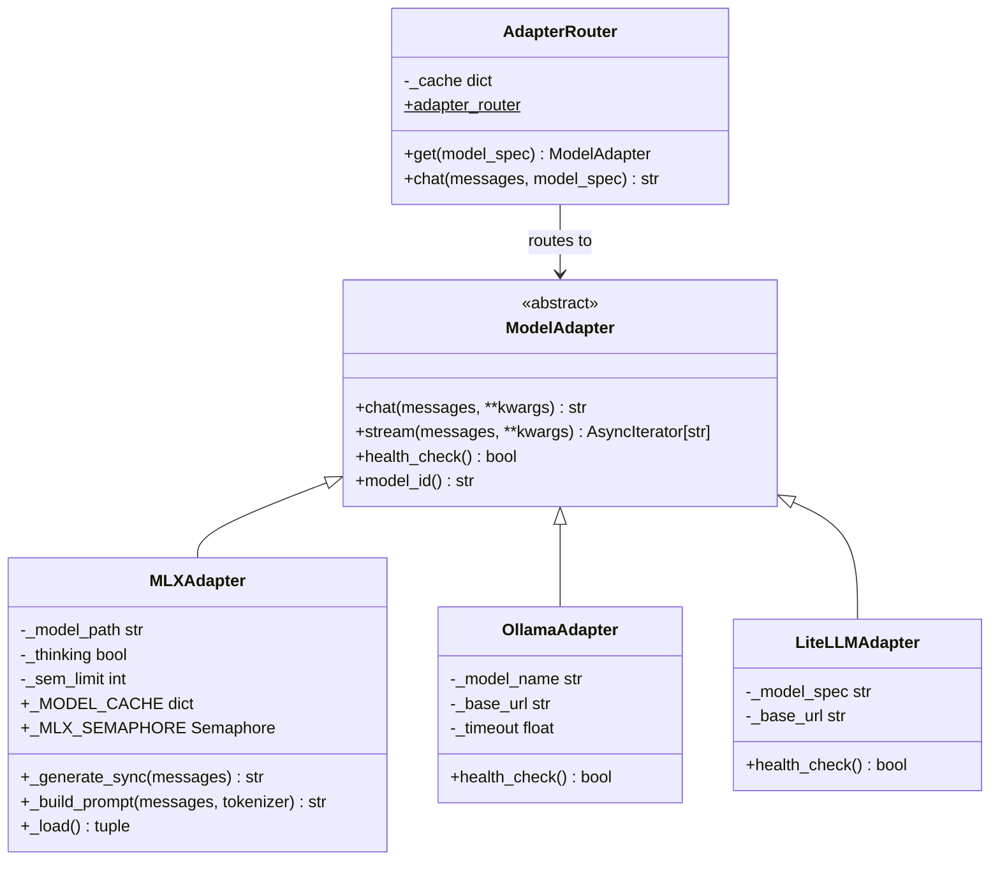
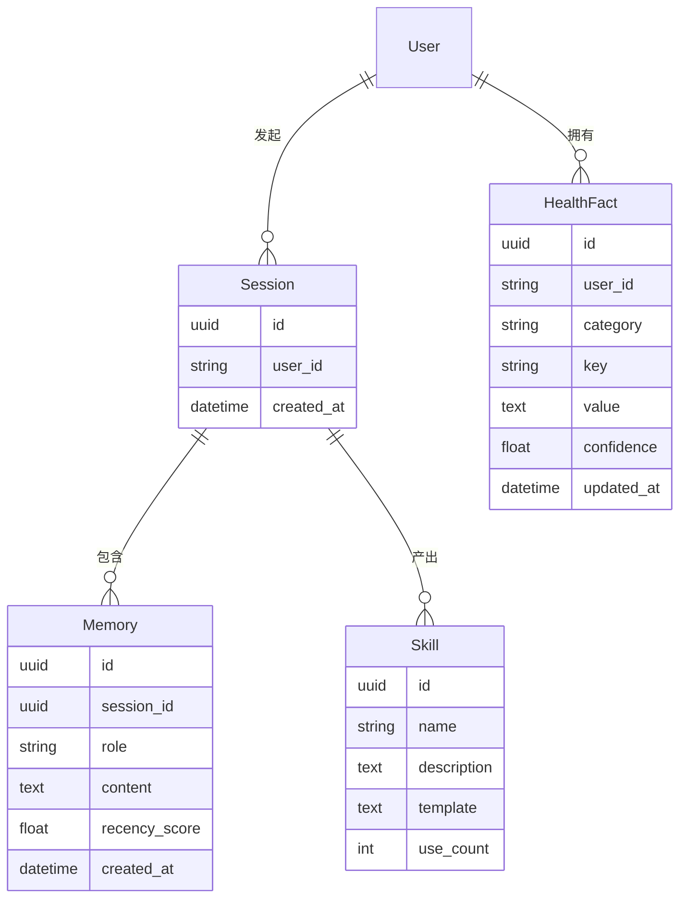
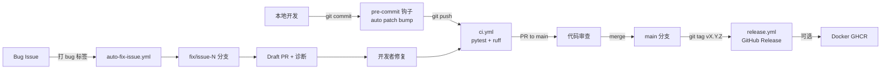

# RHYTHMIND 律动 — 架构文档

> 作者：外星动物（常智）/ IoTchange · v0.1.1  
> 许可：CC BY-NC 4.0

---

## 1. 设计原则

| 原则 | 实现方式 |
|------|----------|
| **本地优先** | MLX 直接推理，数据不离设备 |
| **合规内建** | 每次 LLM 输出均经 PromptAuditor 审查 |
| **可扩展模型** | ModelAdapter ABC 抽象，新增后端不改业务层 |
| **可测试性** | 模块级导入 + 依赖注入，全量 mock 测试 |
| **渐进式复杂度** | 单实例 → ARQ 多实例 → 分布式，平滑升级 |

---

## 2. 分层架构



---

## 3. 核心组件详解

### 3.1 HermesBase — 6 步执行循环

`src/rhythmind/core/hermes_base.py`

```
┌─────────────────────────────────────────────────────┐
│                    HermesBase.run()                  │
│                                                      │
│  Step 1: recall_memory(task)                        │
│    └─ MemoryManager.recall() → 历史上下文           │
│                                                      │
│  Step 2: retrieve_skills(task)                      │
│    └─ SkillEngine.retrieve() → 相关技能             │
│                                                      │
│  Step 3: execute / call_llm(messages)               │
│    └─ AdapterRouter.chat() → raw_reply              │
│                                                      │
│  Step 4: compliance_check(raw_reply)                │
│    └─ PromptAuditor.audit() → passed / blocked      │
│                                                      │
│  Step 5: extract_skills(raw_reply)                  │
│    └─ SkillExtractor.extract() → 新技能持久化       │
│                                                      │
│  Step 6: update_memory(result)                      │
│    └─ MemoryManager.update() + FactManager.update() │
└─────────────────────────────────────────────────────┘
```

**关键设计**：
- 每个 Step 均可独立 mock，便于测试
- `call_llm()` 支持 `model_spec` 参数覆盖默认模型
- Step 4 合规失败时返回标准拒绝文本，不抛异常

### 3.2 AG2 Swarm 流水线

`src/rhythmind/orchestrator/workflows/swarm_data_coach.py`



### 3.3 ModelAdapter 层

`src/rhythmind/adapters/`



**路由规则**：

| `model_spec` 前缀 | 路由目标 | 示例 |
|------------------|----------|------|
| `mlx://` | `MLXAdapter` | `mlx://mlx-community/Qwen3-30B-A3B-4bit` |
| `ollama://` | `OllamaAdapter` | `ollama://gemma3:4b` |
| 其他 | `LiteLLMAdapter` | `gpt-4o`, `anthropic/claude-3-5-sonnet` |

### 3.4 MCP Server

`src/rhythmind/mcp/`

```
Client (Claude / IDE)
    │
    │  GET /mcp/sse  (SSE 长连接)
    ▼
SseServerTransport
    │
    ├── build_mcp_server()  ← per-connection 实例
    │       ├── rhythmind_status      查询平台运行状态
    │       ├── rhythmind_search      全文搜索健康知识
    │       ├── rhythmind_fact_query  查询健康事实
    │       ├── rhythmind_fact_update 更新健康事实
    │       └── rhythmind_session_log 查询会话日志
    │
    │  POST /mcp/messages/  (消息推送)
    ▼
_sse_transport.handle_post_message()
```

---

## 4. 数据流

### 4.1 健康咨询完整链路

```
用户请求
    │
    ▼
FastAPI /chat
    │
    ▼
SwarmDataCoach.run()
    │
    ├─► MetricsAgent.run()
    │       ├── InfluxDB.query(time_range)
    │       ├── QMDClient.fetch()
    │       └── return MetricsPacket
    │
    ├─► DataAgent.run(metrics)
    │       ├── 统计摘要 + 异常检测
    │       ├── HermesBase.call_llm(analysis_prompt)
    │       │       └── AdapterRouter → MLXAdapter
    │       └── return AnalysisReport
    │
    └─► CoachAgent.run(report)
            ├── FactManager.query(user_profile)
            ├── HermesBase.call_llm(coach_prompt)
            │       └── AdapterRouter → MLXAdapter
            ├── PromptAuditor.audit(reply)
            │       └── OllamaAdapter(gemma3:4b)
            └── return HealthAdvice
```

### 4.2 记忆与知识图谱



---

## 5. 并发与性能

### 5.1 M4 16GB 资源规划

| 模型 | 显存占用 | 用途 | 并发控制 |
|------|---------|------|---------|
| Qwen3-30B-A3B-4bit (MLX) | ~6GB | 主推理 | `asyncio.Semaphore(1)` |
| gemma3:4b (Ollama) | ~3GB | 合规审查 | HTTP 连接池 |
| 系统 + FastAPI | ~2GB | 运行时 | — |
| 剩余 | ~5GB | Buffer | — |

### 5.2 并发模型

```
单实例模式（当前）:
  FastAPI (single worker)
      └── asyncio 事件循环
              ├── MLX 推理 → Semaphore(1) 串行
              ├── Ollama HTTP → 异步并发
              └── SQLite → aiosqlite 异步

多实例模式（规划）:
  Nginx
  ├── FastAPI Worker 1 ─┐
  ├── FastAPI Worker 2 ─┼── ARQ Worker Pool ── Redis Queue
  └── FastAPI Worker N ─┘         └── MLX 推理（进程隔离）
```

---

## 6. CI/CD 流程



---

## 7. 扩展指南

### 新增 Agent

```python
from rhythmind.core.hermes_base import HermesBase

class NutritionAgent(HermesBase):
    agent_name = "nutrition_agent"

    async def execute(self, task: str, context: dict) -> str:
        # 实现营养分析逻辑
        return await self.call_llm(
            messages=[{"role": "user", "content": task}],
            model="mlx://mlx-community/Qwen3-30B-A3B-4bit"
        )
```

### 新增 ModelAdapter

```python
from rhythmind.adapters.model_adapter import ModelAdapter

class VllmAdapter(ModelAdapter):
    @property
    def model_id(self) -> str:
        return self._model

    async def chat(self, messages, *, temperature=0.1,
                   max_tokens=512, **kwargs) -> str:
        # 实现 vLLM HTTP 调用
        ...

    async def health_check(self) -> bool:
        # GET /health
        ...
```

在 `AdapterRouter.get()` 中注册新前缀：

```python
elif spec.startswith("vllm://"):
    model_name = spec[len("vllm://"):]
    adapter = VllmAdapter(model_name)
```

### 新增 MCP 工具

在 `src/rhythmind/mcp/server.py` 的 `build_mcp_server()` 中添加：

```python
@server.call_tool()
async def handle_call_tool(name, arguments):
    if name == "rhythmind_nutrition":
        # 调用 NutritionAgent
        ...
```

---

_RHYTHMIND 律动 · 架构文档 · Copyright 2024-2025 外星动物（常智）/ IoTchange_
