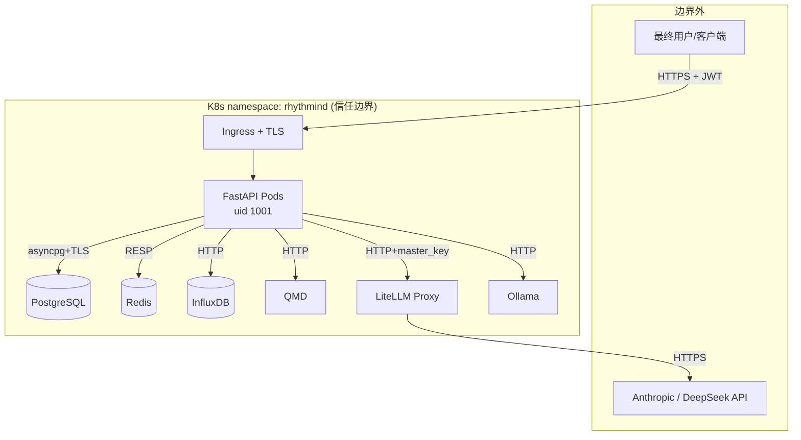

# RHYTHMIND 律动 — 威胁建模 (STRIDE)

> 适用版本：0.1.5+
> 维护者：外星动物（常智）/ IoTchange · 14455975@qq.com
> 上次评审：2026-05-09

本文使用 STRIDE 框架对 RHYTHMIND 的主要可信组件做威胁分析。每个组件给出
现有控制（已落地）与残余缺口（待办）。配套读：[SECURITY.md](SECURITY.md) 残余风险表、
[RUNBOOK.md](RUNBOOK.md) 应急处置、[DEPLOYMENT.md](DEPLOYMENT.md) 安全配置基线。

---

## 1. 资产与攻击者模型

### 1.1 核心资产（按优先级）

| 优先级 | 资产 | 位置 |
|---|---|---|
| P0 | 用户健康指标 / 时序数据 | PG (`agent_memory`, `health_fact`)、InfluxDB |
| P0 | JWT 签名密钥 | K8s Secret（`JWT_SECRET`） |
| P0 | 用户身份会话 | JWT token、Redis 会话缓存 |
| P1 | 训练计划 / 健康建议（输出） | API 响应、Hermes Memory |
| P1 | LLM API key | K8s Secret（`ANTHROPIC_API_KEY`、`DEEPSEEK_API_KEY`、`LITELLM_MASTER_KEY`） |
| P1 | LiteLLM 配额 | 第三方账单 |
| P2 | Skill 库（共享） | PG (`skill_record`)、QMD `agent_skills` |
| P2 | 合规规则集 | `data/compliance_rules`、QMD `compliance_rules` |
| P3 | 服务可用性 | API Pods、依赖组件 |

### 1.2 攻击者画像

| 类型 | 能力 | 目标 |
|---|---|---|
| **未认证外部** | 公网 HTTP，无任何凭据 | DoS、扫描漏洞、刷接口 |
| **认证用户** | 持有合法 JWT | 越权访问他人数据、滥用 LLM 配额、注入 prompt 操纵输出 |
| **被入侵用户** | JWT 被钓鱼 / 设备失窃 | 假冒用户操作；窃取该用户历史 |
| **恶意内部** | 集群 / DB 访问权限 | 直接读取数据、改 secret、篡改技能库 |
| **供应链** | 控制依赖包 / 镜像仓库 | RCE、数据窃取 |
| **AI 提示注入** | 通过用户输入诱导 LLM 越权 | 让 Agent 执行违反合规的输出 |

---

## 2. 系统数据流

**信任边界**有三道：

1. **TB1（公网 ↔ Ingress）** — 外部不可信，强制 TLS + WAF 之后才进入。
2. **TB2（Ingress ↔ 应用 Pod）** — 集群内部网络，但仍需要 NetworkPolicy 限制。
3. **TB3（应用 ↔ 第三方 API）** — egress 出公网，凭据是 K8s Secret 中的 LLM key。

---

## 3. 组件级 STRIDE

下表中：✓ = 已落地控制；△ = 部分覆盖；✗ = 未覆盖（残余风险）。

### 3.1 FastAPI 应用 / API 网关层

| 类别 | 威胁 | 现状 | 缓解 |
|---|---|---|---|
| **S** Spoofing | 未鉴权调用受保护接口 | ✓ | `HTTPBearer(auto_error=True)` + JWT HS256；`assert_production_safe()` 拒默认 secret |
| **S** | dev_auth_bypass 误用进生产 | ✓ | `dev_auth_bypass=True` + `ENV=prod` → 启动直接 raise；多层冗余守卫 |
| **T** Tampering | JWT 篡改 | ✓ | HS256 签名校验；`JWT_SECRET ≥32` 字符强制 |
| **T** | 请求体注入（pydantic 边界） | ✓ | 全部 endpoint 用 pydantic `BaseModel`，含 `field_validator` |
| **T** | 跨用户越权（user_id 字符串拼接） | ✓ | 路由层强制 `CurrentUserId` 依赖 + `confirm_token == user_id` 双层确认；自动化越权回归测试见 `tests/integration/test_authz_and_hardening.py::test_user_a_cannot_export_or_delete_user_b_data` |
| **R** Repudiation | 用户否认操作 | △ | structlog 记录 `user_id` + `path` + `status`；缺少**不可篡改审计存储**（如 append-only S3 / 审计 DB） |
| **I** Info Disclosure | 错误堆栈外泄 | ✓ | `global_exception_handler` 返回固定文案；详细堆栈仅入日志 |
| **I** | `/docs` 在生产暴露 schema | ✓ | `env=prod` 时 `docs_url=None` |
| **I** | CORS 过宽 | ✓ | 生产 `CORS_ALLOW_ORIGINS` 必须显式枚举；空 = 拒所有跨域 |
| **I** | 日志含 PII | △ | Sentry `send_default_pii=False`；structlog 约定不打请求体 — 缺少 lint 规则强制 |
| **D** DoS | 单用户打爆 LLM 预算 | ✓ | Redis 双层限流（user 30/min + IP 60/min on /upload）；`LoopGuard` 防自循环 |
| **D** | Slow-loris / 大 body | ✓ | `RequestSizeLimitMiddleware`（默认 1 MiB；`max_request_body_bytes` 可配）+ Ingress `client_max_body_size`；超限直接 413，不进 handler |
| **E** EoP | 路由层未鉴权 | ✓ | privacy 与 health 路由都强制 `CurrentUserId`；CI 应增 lint 检查（待补） |

### 3.2 Hermes 6 步执行循环 / Agent 编排

| 类别 | 威胁 | 现状 | 缓解 |
|---|---|---|---|
| **S** | Prompt 注入伪装"系统指令" | △ | 双层合规：前置 `PromptAuditor`（gemma 本地审查）+ 后置 `ComplianceGate` 关键词扫 + 置信度。**缺**：用户输入与 system prompt 之间的字符级隔离（如 spotlight tags） |
| **T** | 跨用户记忆污染 | ✓ | `MemoryManager` 强制 namespace `user/{user_id}/{agent}`；`test_qmd_isolation.py` 11 条用例 |
| **T** | Skill 中毒（攻击者诱导 SkillEngine 提取恶意片段） | ✓ | v0.1.6：`SkillRecord.status` 三态 + `skill_require_approval` 开关——`True` 时新提取 skill 进入 `pending`，必须 admin 通过 `POST /admin/skills/{hash}/approve` 后才推 QMD；admin 操作走 `audit_log()` 留痕 |
| **R** | "AI 没让我这样做"否认 | △ | 每个 Agent 输出含 `confidence_chain`、`triggered_keywords`，可追溯；缺少端到端 trace ID 贯穿前端（建议补 `X-Request-Id` 中间件） |
| **I** | LLM 在响应里泄露其它用户上下文 | ✓ | Hermes recall 严格按 `user_id`；MLX/Ollama/LiteLLM 是无状态客户端调用 |
| **D** | RehabAgent 触发自循环 | ✓ | `LoopGuard`（Redis TTL，per user+intent，24h 内 ≤3 次） |
| **D** | MLX OOM 拖慢全部请求 | ✓ | `mlx_semaphore_limit=1` 串行；推荐生产用 ollama 路径 |
| **E** | "你现在是 admin" 之类的 prompt 让 Agent 越权 | △ | 系统并未在 LLM 端实现"权限"，所有越权都得通过 API 接口 — 但**输出**可能仍被诱导给出非合规建议；ComplianceGate BLOCK 路径覆盖关键词，但 LLM-as-judge 二次审查更稳 |

### 3.3 模型适配层（MLX / Ollama / LiteLLM）

| 类别 | 威胁 | 现状 | 缓解 |
|---|---|---|---|
| **S** | LiteLLM master key 泄露 | ✓ | K8s Secret + `assert_production_safe()` 拒 `sk-1234`/`sk-test`；建议每 90 天轮换 |
| **T** | MLX 模型文件被替换 | △ | 镜像层只读；但 MLX `_MODEL_CACHE` 从远程 HF 拉取首次加载 — **首次 pull 完整性靠 HF 自身签名**；建议预置已校验的本地路径 |
| **R** | "LLM 说这是医疗建议"否认链路 | ✓ | structlog 每次调用记 adapter+用时+token；Prometheus `rhythmind_llm_calls_total{adapter,result}` 长期归档 |
| **I** | 输入数据落到第三方 LLM 提供商日志 | △ | Anthropic/DeepSeek 自有数据保留策略；用户可选 `MODEL_PRIMARY_SPEC=ollama://` 全本地路径；**还需**在用户协议里显式说明数据流向 |
| **D** | 第三方 LLM 5xx 雪崩 | ✓ | LiteLLM 自身重试；adapter 抛错被 `LLM_CALLS{result="error"}` 计数 + `RhythmindLLMErrorRateHigh` 告警 |
| **E** | 攻击者通过 `model_spec` 注入任意 URL | △ | adapter_router 仅识别 `mlx://` / `ollama://` / 其它 → LiteLLM；`mlx://` 字符串直接拼到 HF repo 路径 — **缺**对 `model_spec` 的白名单校验（用户 API 路径目前不接受外部传 model_spec，仅设置项；改 API 时要小心） |

### 3.4 PostgreSQL（持久化主存储）

| 类别 | 威胁 | 现状 | 缓解 |
|---|---|---|---|
| **S** | DB 直连凭据泄露 | ✓ | DSN 通过 K8s Secret 注入；`assert_production_safe()` 拒默认 `rhythmind:rhythmind` |
| **T** | SQL 注入 | ✓ | 全部走 SQLAlchemy ORM `where(User.user_id == X)` bindparam；无字符串拼接 |
| **T** | Schema 漂移导致迁移失败 | ✓ | Alembic + CI 检查；K8s `migrationJob` 作为 Helm pre-install hook 单实例运行 |
| **R** | 谁改了哪条记录 | ✗ | 当前**没有审计列**（`updated_by` / `change_log` 表）；建议为 `health_fact` 加事件日志 |
| **I** | 备份介质泄露 | △ | 假设托管 DB（RDS/PolarDB）默认加密；备份策略仍待文档化（RUNBOOK §2.1 有 placeholder） |
| **D** | 连接池耗尽 | ✓ | `pg_pool_size=10`/`max_overflow=20`（per-Pod）+ HPA；监控 `pg_stat_activity` |
| **E** | 应用账户权限过宽 | ✗ | 当前 DSN 用 `rhythmind` 超级用户；**建议**生产用最小权限账号（仅 SELECT/INSERT/UPDATE/DELETE 自身 schema） |

### 3.5 Redis（LoopGuard / RateLimit / 会话缓存）

| 类别 | 威胁 | 现状 | 缓解 |
|---|---|---|---|
| **S** | Redis 未鉴权（默认即裸开放） | △ | docker-compose 默认无密码，依赖 NetworkPolicy 限访；**生产强烈建议**开启 ACL/`requirepass` |
| **T** | LoopGuard / 限流计数被篡改 | △ | Redis 内部 INCR 原子；外部需要先入侵 Redis Pod |
| **R** | "我没超限"否认 | ✓ | 限流命中时 structlog `rate_limit.blocked user_id route count retry_after` |
| **I** | 用户记忆缓存中包含敏感字段 | ✓ | 当前缓存仅存 LRU AgentBundle 与计数；不缓存原始指标 |
| **D** | Redis 抖动 → 限流降级放行 → 雪崩 | △ | 我们把 fail-open 视为业务连续性优先；**残余**：Redis 不可达期间被恶意刷接口的窗口 — 建议加 IP 级 nginx-ingress `limit_req` 二次防护 |
| **E** | Redis 被入侵后写入恶意 LoopGuard key 阻塞合法用户 | ✗ | 无独立缓解 — 依赖 Redis 自身访问控制 |

### 3.6 InfluxDB（时序）

| 类别 | 威胁 | 现状 | 缓解 |
|---|---|---|---|
| **S** | Token 泄露 | ✓ | K8s Secret + `assert_production_safe()` 拒默认 token |
| **T** | 用户跨设备覆盖时序 | △ | 写入按 `user_id` tag 隔离；但**缺**写入侧的服务端校验（应用层 trust） |
| **I** | 跨用户读取 | ✓ | `InfluxClient.query_range` 强制 `user_id=` 过滤；无任意 Flux 查询接口暴露 |
| **D** | 时序写入风暴 | △ | Influx 自带反压；应用侧没有写入限速 |

### 3.7 QMD（语义检索）

| 类别 | 威胁 | 现状 | 缓解 |
|---|---|---|---|
| **S** | QMD 接口未鉴权 | △ | 集群内 NetworkPolicy 限制；公网不可达 |
| **T** | Skill 库被污染（攻击者构造高 confidence 内容） | ✓ | v0.1.6：与 §3.2 同源；新 skill 默认 `pending`，仅 approved 后由 SkillEngine 推 QMD；rejected 永不推也不复用 |
| **I** | 用户 namespace 隔离 | ✓ | `_enforce_namespace` 单测 11 条覆盖 |
| **D** | QMD 不可用 | ✓ | HermesBase 降级跳过 retrieve_skills 步骤，业务不中断（`hermes.run qmd_unavailable fallback=empty_skills`） |

### 3.8 MCP Server（对外工具暴露）

| 类别 | 威胁 | 现状 | 缓解 |
|---|---|---|---|
| **S** | MCP SSE 端点是否需要鉴权 | ✓ | 默认 `mcp_require_auth=True`：`/mcp/sse` 与 `/mcp/messages/` 都走 `_maybe_authenticated_user`；ENV=prod 时 `assert_production_safe()` 强制为 True；测试见 `test_authz_and_hardening.py::test_mcp_messages_requires_bearer_by_default` |
| **T** | MCP tool 调用篡改 | △ | tool 入参由 MCP 协议本身校验；建议在 tool 入口同样做 `compliance.pre_check` |
| **I** | MCP 暴露的工具列表泄露内部能力 | △ | 内置 5 个工具（status/search/fact/session_log）—— 内部可用即可，不应暴露给非内部调用方 |

> **行动项**：把 `/mcp/*` 也挂到 `CurrentUserId` 依赖下；或者通过独立 ingress 接受 mTLS。

---

## 4. 跨切面威胁

### 4.1 供应链

- **依赖**：`pyproject.toml` 锁版本 + `poetry.lock` + CI `poetry-lock-check`；建议加 `pip-audit` / `osv-scanner` 步骤
- **基础镜像**：`python:3.12-slim`，建议固定 digest（`python:3.12-slim@sha256:...`）
- **GitHub Actions**：建议把 `actions/*` 全部 pin 到 commit SHA 防 supply-chain 投毒

### 4.2 加密

- 传输：TLS 由 Ingress 终结；建议 internal 服务也开 mTLS（service mesh）
- 静态：依赖云厂商默认加密；建议为 PG/Influx 显式开启 `?ssl=require`
- 密钥轮换：JWT_SECRET / LITELLM keys 90 天轮换流程**待文档化**

### 4.3 备份与恢复

- **缺**：自动化 PITR 演练；现有 RUNBOOK §2.1 仅有手动 placeholder
- **缺**：用户数据导出 + 删除流程在备份介质上的传播策略（GDPR/PIPL 要求）

### 4.4 物理 / 运维

- 假设公有云托管，物理安全由云厂商负责
- 运维侧建议 SSO + MFA + 审计 kubectl exec 行为

---

## 5. 主要残余风险（需要排期修）

按优先级排序，每条对应到 [SECURITY.md §3](SECURITY.md) 的 R-编号或本文位置：

| # | 风险 | 位置 | 状态 / 修复建议 |
|---|---|---|---|
| ~~1~~ | MCP 端点未鉴权 | §3.8 | **已修复** v0.1.5：`mcp_require_auth=True` 默认 + 生产强制 |
| ~~2~~ | 越权回归测试空白 | §3.1 T | **已修复** v0.1.5：`test_user_a_cannot_export_or_delete_user_b_data` |
| **3** | 不可篡改审计日志 | §3.1 R / §3.4 R | 关键操作（privacy.delete、模型 spec 切换、健康指标上传）外送 append-only S3 |
| ~~4~~ | Skill / QMD 中毒 | §3.2 T / §3.7 T | **已修** v0.1.6：`SkillRecord.status` (pending/approved/rejected) + `settings.skill_require_approval` 开关 + `/api/v1/admin/skills/*` 审核端点；只有 approved skill 推到 QMD（详见 [`api/routers/admin.py`](../src/rhythmind/api/routers/admin.py) 与 `tests/integration/test_admin_skill_approval.py`） |
| **5** | DB 最小权限账号 | §3.4 E | 生产账号去掉 SUPERUSER；DDL 用单独账号给 alembic |
| **6** | 备份/PITR 真演练 | §4.3 | 季度演练 + RTO/RPO 写入 RUNBOOK |
| ~~7~~ | 依赖 SBOM + 漏洞扫描 | §4.1 | **部分修复** v0.1.5：CI `dep-audit` + `image-scan` 已挂上（warn-only），噪音稳定后改 strict |
| **8** | Redis 鉴权 | §3.5 S | 生产开启 ACL/`requirepass`，并把凭据放 Secret |
| **9** | LiteLLM 数据出境告知 | §3.3 I | 用户协议明确数据流向；非本地化客户强制 ollama:// 路径 |
| ~~10~~ | 请求大小硬上限 | §3.1 D | **已修复** v0.1.5：`RequestSizeLimitMiddleware`（默认 1 MiB） |

---

## 6. 评审节奏

- 每次 minor release 前过一次本文档，标注哪些控制是新加 / 哪些 gap 已关闭
- 任何下面的变更触发**重新评审**：
  - 新增外部接口 / 改鉴权流程
  - 引入新模型提供商或新数据出境路径
  - 改 secret / KMS 处理逻辑
  - 引入新的用户数据存储
- 评审记录追加到本文末尾或单开 `THREAT_MODEL_CHANGELOG.md`

---

## 7. 修订历史

- **2026-05-09 v1.0** — 首版，覆盖 8 个核心组件 + 4 个跨切面，列出 10 项主要残余风险
