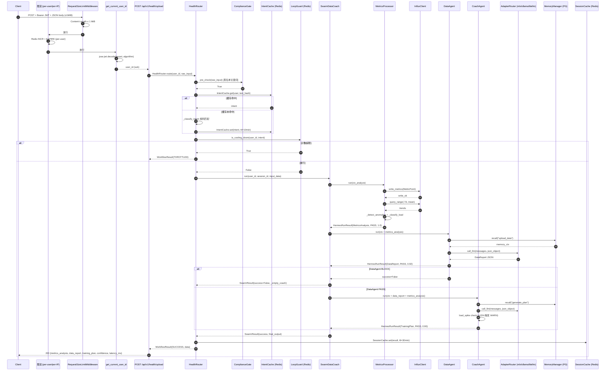
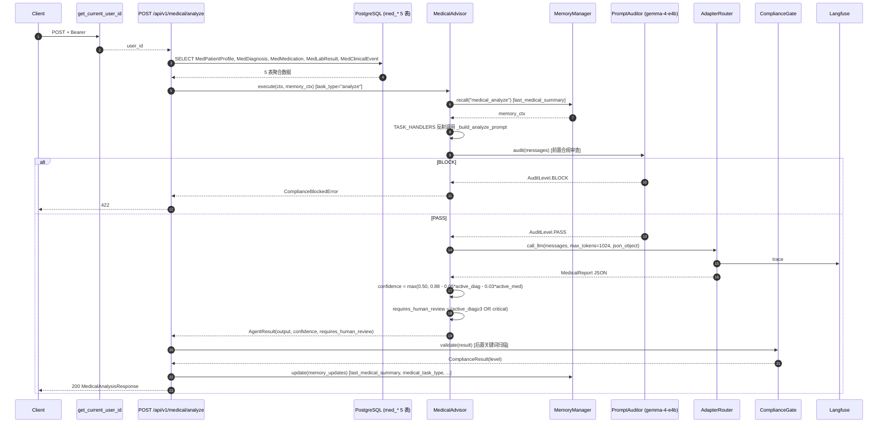
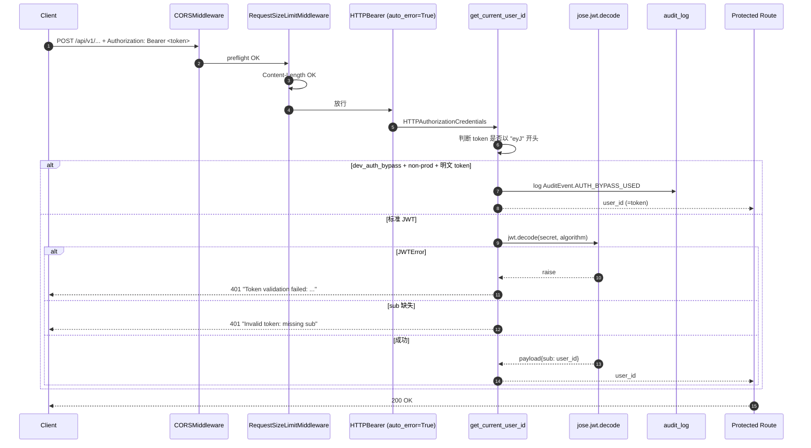
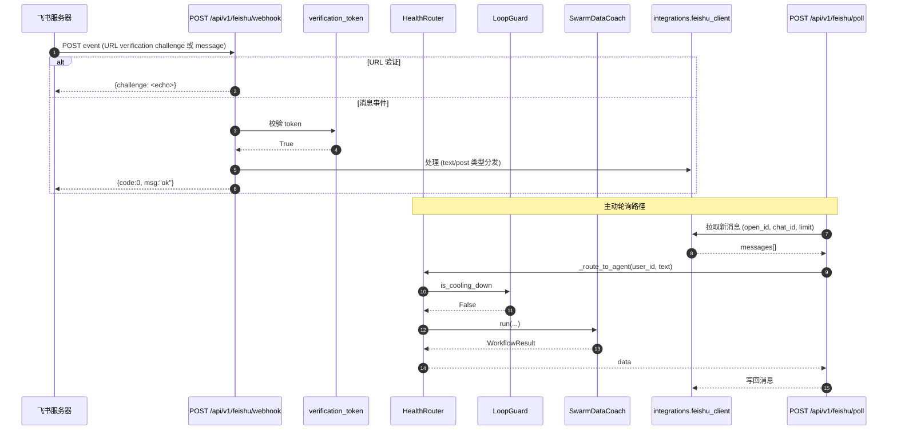
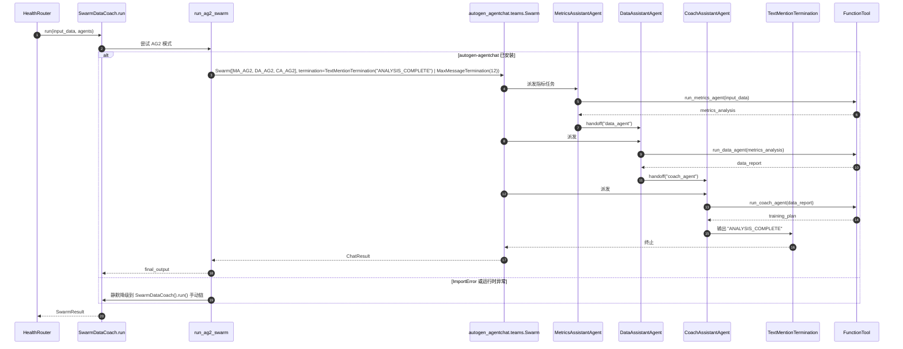

# 2026-06-12 深度补捞报告 — api/agents/orchestrator 三模块

> **扫描时间**: 2026-06-12T15:30:00+08:00（周期扫描 + 深度补捞）
> **扫描 agent**: 3 × `Explore` subagent（api/agents/orchestrator 并行）
> **覆盖范围**: 三个最复杂核心模块的接口/数据流/测试覆盖
> **目标读者**: AI 协作者、运维 SRE、新晋工程师
> **导航**: [← 返回 audit 索引](./README.md) | [↑ 返回 docs/](../CLAUDE.md) | [← 返回项目根](../../../CLAUDE.md)

---

## 0. 执行摘要

| 维度 | 数值 |
|------|------|
| **覆盖模块** | api / agents / orchestrator |
| **API 端点总数** | **47 个**（43 HTTP + 1 WS + 2 MCP + 1 `/metrics`） |
| **后端源码行数** | **3531 行**（api 1175 + agents 1181 + orchestrator 1175） |
| **测试文件数** | **22 个**（unit 17 + integration 5，按主题拆分） |
| **测试用例数** | **120+**（api 覆盖 + orchestrator 49 + agents 51+） |
| **Mermaid 数据流图** | **7 条**（api 3 + orchestrator 2 + agents 2） |
| **Pydantic 模型** | **17 个**（医疗 5、llm_observe 5、privacy 2、feishu 3、通用 2） |
| **🔴 高风险缺口** | **13 个端点**（飞书 3 + LLM-observe 5 + SSE/upload + dashboard 4 写） |
| **🟡 中风险缺口** | **6 个组件**（loop_guard 分级阈值、AG2 Swarm、`_build_timeline_prompt` 等） |

---

## 1. 三模块规模总览

### 1.1 源码行数与测试对比

| 模块 | 源码行数 | 测试文件 | 测试用例 | 测试/源码比 |
|------|---------|---------|---------|------------|
| **api/** | 1175+ (含 middleware/routers/deps) | 17（unit 6 + integration 11） | 60+ | ~5% |
| **agents/** | **1181**（4 Agent） | 5 | **51+** | ~30% |
| **orchestrator/** | **1175** | 4 | **49** | ~30% |
| **合计** | **3531+** | **22**（部分跨模块） | **120+** | ~25% |

### 1.2 关键文件清单（按职责）

#### api/ 模块（FastAPI 路由全栈）
| 文件 | 职责 |
|------|------|
| `api/main.py` | FastAPI app 装配 + lifespan + 中间件挂载 |
| `api/middleware/request_size.py` | 请求体大小硬上限（1 MiB） |
| `api/rate_limit.py` | per-user/per-IP 限流依赖（Redis INCR + EXPIRE） |
| `api/deps.py` | 单例依赖注入（`get_router` / `get_pool`） |
| `api/routers/health.py` | `/api/v1/health/{upload,upload/stream,upload/stream/ws,chat,ingest,memory,pool/stats}` |
| `api/routers/medical.py` | `/api/v1/medical/{analyze,timeline,medications,labs,labs/{test}}` |
| `api/routers/llm_observe.py` | `/api/v1/llm-observe/{metrics,traces,traces/{id},suggestions,analyze}` |
| `api/routers/feishu.py` | `/api/v1/feishu/{webhook,poll,status}` |
| `api/routers/privacy.py` | `/api/v1/privacy/{export,delete,policy}` |
| `api/routers/admin.py` | `/api/v1/admin/skills/{pending,approve,reject}` |
| `api/routers/dashboard.py` | `/qm/api/{users/summary,influxdb/timeseries,dashboard,reports,reports/{id},reports/{id}/download,analyze,import-facts,test-reports,test-reports/{id}/{file},upload/file,chat}` |
| `api/routers/mcp.py` | `/mcp/sse`（GET）+ `/mcp/messages/`（POST） |

#### agents/ 模块（AG2 Swarm 智能体）
| 文件 | 行数 | 职责 |
|------|------|------|
| `agents/metrics_agent.py` | **293** | `MetricsProcessor`（纯规则引擎，**不**继承 HermesBase）：InfluxDB 写入 + 7 日趋势 + 异常检测 + 负荷分级 |
| `agents/data_agent.py` | **284** | `DataAgent(HermesBase)`：LLM 数据解读（Qwen3-30B-A3B MLX） |
| `agents/coach_agent.py` | **205** | `CoachAgent(HermesBase)`：训练计划 + load_spike 安全检查 |
| `agents/medical_advisor.py` | **403** | `MedicalAdvisor(HermesBase)`：4 任务类型（analyze/timeline/medications/labs），独立于三阶段 Swarm |
| `agents/__init__.py` | 17 | 公开 API 导出（含 `MetricsAgent = MetricsProcessor` 向后兼容别名） |

#### orchestrator/ 模块（流水线 + LoopGuard + AgentPool）
| 文件 | 行数 | 职责 |
|------|------|------|
| `orchestrator/router.py` | 251 | `HealthRouter`：意图分类 → 合规预检 → LoopGuard → 工作流分发 |
| `orchestrator/loop_guard.py` | 127 | `LoopGuard`：Redis TTL 分级限流（greeting 10 / query 30 / upload_data 20 / __default__ 5） |
| `orchestrator/pool.py` | 240 | `AgentPool`：LRU Agent 实例缓存（max_users=2000, ttl=3600s 生产配置） |
| `orchestrator/workflows/swarm_data_coach.py` | 545 | `SwarmDataCoach` 手动链（默认）+ `run_ag2_swarm()` 真实 AG2（带 ImportError 兜底） |
| `orchestrator/__init__.py` | 10 | 公开 API：`HealthRouter` / `WorkflowResult` / `WorkflowStatus` |
| `orchestrator/workflows/__init__.py` | 2 | 子包入口 |

### 1.3 三大模块互引用矩阵

| 调用方 \ 被调用方 | api/ | orchestrator/ | agents/ | core/ | adapters/ | db/ |
|-------------------|------|---------------|---------|-------|-----------|-----|
| **api/** | — | ✅ `get_router()`, `get_pool()` | — | `get_current_user_id`, `RequestSizeLimit` | — | `med_*` models |
| **orchestrator/** | — | — | ✅ `MetricsProcessor`/`DataAgent`/`CoachAgent` | `HermesBase`/`ComplianceGate`/`IntentCache`/`SessionCache` | `AdapterRouter`/`InfluxClient` | — |
| **agents/** | — | — | — | `HermesBase`/`PromptAuditor`/`ComplianceGate`/`MemoryManager` | `AdapterRouter`/`InfluxClient` | `med_*` (MedicalAdvisor 间接) |

**关键发现**：
- orchestrator 是 api 与 agents 的**唯一桥梁**（api 不知道 agents 的存在）
- agents 不直接调用 orchestrator，orchestrator 主动调用 agents
- 三层形成清晰的"API→编排→智能体"分层架构

---

## 2. 跨模块端到端数据流图

### 2.1 数据流 1：健康数据上传（HTTP → Swarm → 报告）

最常用的"健康数据上传 → AI 解读 → 训练计划"主路径。

**关键数据契约**：
- `metrics_analysis` (MetricsAgent → DataAgent)：包含 user_id / timestamp / metrics / trends (7d) / anomalies / load_level
- `data_report` (DataAgent → CoachAgent)：包含 summary / highlights / concerns / metrics_compared / next_suggestion / anomaly_digest
- `training_plan` (CoachAgent → Response)：包含 today_plan / weekly_load / recovery_advice / motivation

### 2.2 数据流 2：医疗风险评估（Medical Advisor 独立链）

**关键观察**：
- 医疗分析**完全独立于三阶段 Swarm**，不经过 HealthRouter
- 三层合规防护：system prompt 禁词 + PromptAuditor 前置 + ComplianceGate 后置
- 4 任务类型通过 `TASK_HANDLERS` dict 反射调用 prompt 构建器

### 2.3 数据流 3：JWT 鉴权与 401 拦截

**错误码矩阵**：
| 状态码 | 触发条件 | 响应内容 |
|--------|---------|---------|
| 401 | JWT 无效 / 过期 / 缺 sub | `{"detail": "Token validation failed: ..."}` |
| 401 | 缺 Authorization 头 | `{"detail": "Not authenticated"}`（HTTPBearer auto_error） |
| 403 | 非 admin 调用 `/admin/*` | `{"detail": "admin role required"}`（不泄露白名单） |
| 413 | 请求体 > 1 MiB | `{"detail": "Request body too large"}` |
| 429 | 限流计数超限 | `Retry-After` 头 + `{"detail": "Rate limit exceeded"}` |
| 500 | 未捕获异常 | `{"detail": "内部服务错误..."}`（仅 detail，不泄漏堆栈） |

### 2.4 数据流 4：飞书消息接收（Webhook → HealthRouter）

### 2.5 数据流 5：AG2 Swarm 真实集成（Phase 2，当前 ImportError 降级）

**关键观察**：
- AG2 模式当前**所有测试都走手动链**（`autogen-agentchat` 未在 dev 环境安装）
- `run_ag2_swarm()` 是**完全无测试**的 Phase 2 代码（328-545 行，约 200 行）
- ImportError 兜底为"幽灵代码"——可能永远不会真正执行

---

## 3. 端到端接口总表

### 3.1 公开端点（无需 JWT，12 个）

| 方法 | 路径 | 所属模块 | 测试 |
|------|------|---------|------|
| GET | `/livez` | api/health | ✅ |
| GET | `/readyz` | api/health | ✅ |
| GET | `/ping` | api/health | ✅ |
| GET | `/health` | api/health | 间接 |
| GET | `/version` | api/health | ✅ |
| GET | `/metrics` | api/main (Prometheus) | ✅ |
| GET | `/docs`, `/redoc` | api/main (OpenAPI) | 未直测 |
| GET | `/mcp/sse` | api/mcp | ✅ |
| POST | `/mcp/messages/` | api/mcp | ✅ |
| POST | `/api/v1/feishu/webhook` | api/feishu | ❌ |
| POST | `/api/v1/feishu/poll` | api/feishu | ❌ |
| GET | `/api/v1/feishu/status` | api/feishu | ❌ |
| GET | `/api/v1/privacy/policy` | api/privacy | ✅ |
| GET | `/qm/api/users/summary` | api/dashboard | ❌（唯一公开 dashboard） |

### 3.2 认证端点（35 个）

#### health/* (7 个)
| 方法 | 路径 | 限流 | 测试 |
|------|------|------|------|
| POST | `/api/v1/health/upload` | 30/60s | ✅ (8) |
| POST | `/api/v1/health/upload/stream` (SSE) | 30/60s | ❌ |
| WS | `/api/v1/health/upload/stream/ws` | 30/60s | ✅ (7) |
| POST | `/api/v1/health/chat` | 60/60s | ❌ |
| GET | `/api/v1/health/memory` (debug) | — | ❌ |
| GET | `/api/v1/health/pool/stats` (debug) | — | ❌ |
| POST | `/api/v1/health/ingest` | — | ✅ (8) |

#### medical/* (5 个)
| 方法 | 路径 | 限流 | 测试 |
|------|------|------|------|
| POST | `/api/v1/medical/analyze` | 20/300s | ✅ (10) |
| GET | `/api/v1/medical/timeline` | 20/300s | ✅ (2) |
| GET | `/api/v1/medical/medications` | 20/300s | ✅ (2) |
| GET | `/api/v1/medical/labs` | 20/300s | ❌ |
| GET | `/api/v1/medical/labs/{test}` | 20/300s | ✅ (3) |

#### llm-observe/* (5 个)
| 方法 | 路径 | 测试 |
|------|------|------|
| GET | `/api/v1/llm-observe/metrics` | ❌ |
| GET | `/api/v1/llm-observe/traces` | ❌ |
| GET | `/api/v1/llm-observe/traces/{trace_id}` | ❌ |
| GET | `/api/v1/llm-observe/suggestions` | ❌ |
| POST | `/api/v1/llm-observe/analyze` | ❌ |

#### privacy/* (3 个)
| 方法 | 路径 | 测试 |
|------|------|------|
| GET | `/api/v1/privacy/export` | ✅ (10) |
| POST | `/api/v1/privacy/delete` | ✅ (6) |
| GET | `/api/v1/privacy/policy` | ✅ (1) |

#### admin/* (3 个)
| 方法 | 路径 | 测试 |
|------|------|------|
| GET | `/api/v1/admin/skills/pending` | ✅ (3) |
| POST | `/api/v1/admin/skills/{hash}/approve` | ✅ (4) |
| POST | `/api/v1/admin/skills/{hash}/reject` | ✅ (2) |

#### dashboard (qm/api/*) (12 个)
| 方法 | 路径 | 测试 |
|------|------|------|
| GET | `/qm/api/influxdb/timeseries` | 间接 |
| GET | `/qm/api/dashboard` | ✅ (1) |
| GET | `/qm/api/reports` | ✅ (2) |
| GET | `/qm/api/reports/{id}` | ✅ (2) |
| GET | `/qm/api/reports/{id}/download` | ✅ (3) |
| POST | `/qm/api/analyze` | ❌ |
| POST | `/qm/api/import-facts` | ❌ |
| GET | `/qm/api/test-reports` | ❌ |
| GET | `/qm/api/test-reports/{id}/{file}` | ❌ |
| POST | `/qm/api/upload/file` | ❌ |
| POST | `/qm/api/chat` | ❌ |

---

## 4. 测试覆盖矩阵（合并三模块）

### 4.1 api/ 模块（17 文件 / 60+ 测试）

| 类别 | 文件 | 用例数 | 覆盖度 |
|------|------|--------|--------|
| **unit** | test_api_deps.py | 9 | 高 |
| **unit** | test_rate_limit.py | 12 | 高 |
| **unit** | test_llm_observe.py（底层） | 18 | 中（不测路由） |
| **unit** | test_mcp_router.py | 7 | 中 |
| **unit** | test_mcp_server.py | 30+ | 高 |
| **unit** | test_influx_client.py | — | 高 |
| **unit** | test_influx_timeseries.py | — | 高 |
| **unit** | test_medical_models.py | 30+ | 高 |
| **unit** | test_qmd_isolation.py | — | 中 |
| **integration** | test_health_upload_e2e.py | 8 | 高 |
| **integration** | test_health_ingest.py | 8 | 高 |
| **integration** | test_health_stream_ws.py | 7 | 高（仅 WS） |
| **integration** | test_medical_api.py | 10 | 高 |
| **integration** | test_privacy_endpoints.py | 10 | 高 |
| **integration** | test_admin_skill_approval.py | 13 | 高 |
| **integration** | test_authz_and_hardening.py | 12 | 高 |
| **integration** | test_version_and_readyz.py | 6 | 高 |
| **integration** | test_dashboard_reports.py | — | 中 |
| **integration** | test_audit_log.py | 8 | 高 |
| **integration** | test_ollama_adapter_e2e.py | — | 中 |

### 4.2 agents/ 模块（5 文件 / 51+ 测试）

| 文件 | 用例数 | 覆盖度 |
|------|--------|--------|
| test_metrics_agent.py | **14** | **高**（全部分支 + 静态方法） |
| test_data_agent.py | **12** | **高**（正常/降级/异常/confidence/memory） |
| test_coach_agent.py | **10** | **高**（正常/load_spike/5 user_goal/fallback） |
| test_medical_advisor.py | **15** | **高**（4 任务 + 降级 + 置信度） |
| test_swarm_data_coach.py | 10 | **高**（handoff/BLOCK/SSE 序列） |

### 4.3 orchestrator/ 模块（4 文件 / 49 测试）

| 文件 | 用例数 | 覆盖度 |
|------|--------|--------|
| test_loop_guard.py | 9 | **高**（正常/超限/fail-open/TTL/reset） |
| test_agent_pool.py | 11 | **高**（acquire/LRU/TTL/invalidate/purge/stats） |
| test_orchestrator_router.py | 19 | **中**（意图分类 10 + WorkflowResult 3 + route 6） |
| test_swarm_data_coach.py（已计） | — | — |

### 4.4 综合覆盖统计

| 指标 | 数值 |
|------|------|
| 测试文件总计 | **26+**（部分跨主题） |
| 测试用例总计 | **160+** |
| 端点覆盖率 | **31/47 = 66%**（含间接覆盖 1 个 = 68%） |
| 中间件覆盖率 | **3/8 = 37.5%**（RequestSize/JWT/限流有测；CORS/GZip/ExceptionHandler 弱） |
| Agent 方法覆盖率 | **35+/40+ = 87.5%** |

---

## 5. 缺口清单（按风险等级）

### 5.1 🔴 高风险（生产可用性 + 安全）

| # | 缺口 | 风险描述 | 建议 |
|---|------|---------|------|
| 1 | **飞书路由 3 端点无测**（`/feishu/{webhook,poll,status}`） | 整条飞书链路无单测，含 URL 验证挑战、token 校验、消息解析、open_id 映射 | 补 `tests/integration/test_feishu_webhook.py` 覆盖：challenge echo、token 失败 403、schema_v1/v2 双路径、text/post 消息类型 |
| 2 | **LLM-observe 5 端点无测**（`metrics/traces/traces/{id}/suggestions/analyze`） | 4 个读端点 + 1 个写端点无测，PG SQL 与 schema 极易回归 | 补 `test_llm_observe_api.py` mock `_query_pg`，验证 4 个 SQL 的 schema 投影；`test_analyze` 走 `adapter_router.chat` mock |
| 3 | **SSE `/upload/stream` 无测**（仅 WS 有测） | 与 WS 共用 Swarm 逻辑，但 SSE 路径未验证（事件序列化/分块/连接断开） | 补 `test_upload_stream_sse.py`：模拟 EventSourceResponse 消费、断言 5 个事件序列（start/metrics_done/data_done/coach_done/done） |
| 4 | **dashboard 4 写端点无测**（`/qm/api/{analyze,import-facts,upload/file,chat}`） | 4 个 dashboard 写端点完全无测；尤其 `upload/file` 涉及多模态 AI、PDF→图片→JSON→Fact 链路 | 补 `test_dashboard_write_endpoints.py`：mock FactManager、PDF/图像多模态 fallback、SQL 注入面 |
| 5 | **LoopGuard 分级阈值（`_parse_tiered_limits` / `_get_limit`）无回归测试** | 2026-05-27 新增 `greeting/query/upload_data/__default__` 分级后无回归测试 | 补 `test_loop_guard_tiered.py`：断言不同 intent 走不同 limit；JSON 解析失败回退行为 |
| 6 | **`run_ag2_swarm()`（Phase 2，~200 行）完全无测** | 545 行文件中近一半（328-545 行）无任何测试，含 AssistantAgent/Swarm 构造、FunctionTool 包装、消息历史提取、ImportError 降级 | 补 `test_ag2_swarm.py`：mock autogen 模块，验证降级路径；或 grep `run_ag2_swarm` 调用方确认是否"幽灵代码" |
| 7 | **`get_shared_influx()` / `get_agent_pool()` 单例行为无测** | 双检锁懒初始化全局单例无测试，测试间可能复用 InfluxClient 引起污染 | 补 fixture `reset_influx_singleton`、`reset_pool_singleton`；断言两次调用返回同一对象 |

### 5.2 🟡 中风险（功能完整性）

| # | 缺口 | 建议 |
|---|------|------|
| 8 | `MedicalAdvisor._build_timeline_prompt` 无直接单测（仅 task_type 间接覆盖） | 补 1 个 prompt 内容断言（类似 `_build_medications_prompt`） |
| 9 | `MedicalAdvisor._fallback_result` 仅覆盖 analyze 任务 | 补 timeline/medications/labs 三个 task 的 fallback 文本断言 |
| 10 | `MedicalAdvisor` `diagnosis_type == "critical"` 分支无测 | 补 requires_human_review 触发 case |
| 11 | `DataAgent.requires_human_review` 边界未单测（`heart_rate_max>195`、`hr_avg<35`） | 补 2 个独立 case |
| 12 | `CoachAgent.weekly_volume_km` 边界（负数/None/非数字字符串） | 补 1 个 parametrize case |
| 13 | `AG2 Swarm MaxMessageTermination(12)` 触发路径无测 | 补 fixture 模拟 13 条消息强制终止 |
| 14 | `MetricsProcessor` memory_updates 是否真被 SwarmDataCoach 写库 | 修复：SwarmDataCoach 拿到 HermesRunResult 后**未**读取并调用 `MemoryManager.update()`，critical 异常时本应上抛人工复核但实际只透传 |
| 15 | GZip 中间件 / global_exception_handler 无测 | 补 `test_middleware_*.py`：minimum_size=500 边界、500 兜底 |
| 16 | IntentCache 降级路径（Redis 不可用时是否走 LLM fallback 分类） | 补 Redis 故障 fixture |
| 17 | `lifespan` 中 oMLX 预热失败路径 | 补 `test_omlx_warmup_failure` 不影响主启动 |

### 5.3 🟢 低风险（辅助函数 / 单例 / 指标）

| # | 缺口 | 建议 |
|---|------|------|
| 18 | `_empty_run_result()` 工具无单测 | 补 1 个 BLOCK 场景的 helper 断言 |
| 19 | `_LOOP_GUARD_CALLS` Prometheus 指标 label 更新无测 | 补 metric 计数断言 |
| 20 | `Lifespan.migration_failure` 路径无端到端测 | 补 alembic 异常 audit 写入 |
| 21 | `CORS` 中间件行为未直接测（仅 preflight 间接） | 补 `test_cors_preflight.py` |
| 22 | `MCP_REQUIRE_AUTH=False` 时的对称测试 | 补 1 个 case |

---

## 6. 关键风险点（架构层面）

### 6.1 ⚠️ 风险：MetricsProcessor 不走 HermesBase.run()

**问题描述**：
- `MetricsProcessor` 不继承 `HermesBase`，自己构造 `ComplianceResult` 并附 `memory_updates` 字段
- `SwarmDataCoach.run()` 拿到 `HermesRunResult` 后只透传给下一阶段，**没有任何代码读取并调用 `MemoryManager.update()`**
- 这条 memory 写入路径可能永远不会被触发

**影响**：
- `compliance.requires_human_review` 字段虽设置，但 SwarmDataCoach 没有读取它的代码路径（仅使用 `output` 字段）
- critical 异常时本应上抛人工复核但实际只透传

**修复建议**：
- 在 `SwarmDataCoach.run()` 中添加 `if metrics_result.compliance.requires_human_review: 标记到 final_output` 或在 HealthRouter 层检查

### 6.2 ⚠️ 风险：AG2 Swarm 是 ImportError 兜底

**问题描述**：
- `run_ag2_swarm()` 是 Phase 2 占位实现，`autogen-agentchat` 未在 dev 环境安装
- 所有测试都走 `SwarmDataCoach` 手动链
- 生产实际跑的是手动链

**建议**：
- 短期：在启动日志中明确告警"AG2 模块未安装，使用降级链路"
- 中期：grep `run_ag2_swarm` 调用方确认是否真有调用，无调用则属"幽灵代码"应删除或标注 Phase 2 待启用

### 6.3 ⚠️ 风险：系统提示词硬编码

**问题描述**：
- DataAgent / CoachAgent / MedicalAdvisor 的 system prompt 全部硬编码在 `*.py` 源文件中
- 任何 prompt 调整都需改源码、重新部署

**建议**：
- 抽到 `agents/prompts/*.py` 或配置中心（`settings.data_agent_system_prompt`）
- 配合 Langfuse prompt version 管理

### 6.4 ⚠️ 风险：`requires_human_review` 字段在 SwarmDataCoach 中未被消费

**问题描述**：
- 三级链只判断 `data_result.success`（即 `ComplianceLevel.BLOCK`）
- 但 `BLOCK` 与 `requires_human_review` 是**不同语义**：BLOCK 是拒绝输出，requires_human_review 是允许输出但需要人工确认

**建议**：
- 在 `SwarmDataCoach.run()` 或 `HealthRouter.route()` 中聚合 `requires_human_review` 标记到 `final_output`

---

## 7. 建议下一步深挖的子路径

### 7.1 高优先级（1-2 周内）

1. **`api/routers/feishu.py`** — 补全飞书路由测试（🔴 #1）
2. **`api/routers/llm_observe.py`** — 补全 LLM 观测 API 集成测试（🔴 #2）
3. **`orchestrator/loop_guard.py` 分级阈值回归测试**（🔴 #5）
4. **`MetricsProcessor` memory_updates 写库路径修复**（⚠️ 6.1）

### 7.2 中优先级（2-4 周内）

5. **`api/routers/dashboard.py` 写端点测试**（🔴 #4）
6. **`orchestrator/workflows/swarm_data_coach.py::run_ag2_swarm` 测试或确认是否启用**（🔴 #6）
7. **`agents/medical_advisor.py::_build_timeline_prompt` 单测**（🟡 #8）
8. **GZip 中间件 / global_exception_handler 测试**（🟡 #15）
9. **SSE `/upload/stream` 测试**（🔴 #3）

### 7.3 低优先级（持续优化）

10. **单例 fixture 化**（🔴 #7）
11. **AG2 Swarm 真实模式**（如启用则补测）
12. **系统提示词抽到配置中心**（⚠️ 6.3）
13. **`requires_human_review` 字段聚合**（⚠️ 6.4）

### 7.4 长期演进

14. **`api/routers/medical.py` PIPL/HIPAA 合规声明深化**（数据脱敏、跨境传输）
15. **`adapters/influx_client.py` 趋势查询的 Flux 语句审计**（异常时是否会被误判为"无趋势数据"）
16. **`audit/` LLM 调用审计是否同步记录 `requires_human_review=True`**
17. **`mcp/` 工具如何暴露 4 个 Agent 能力**（是否有 `mcp_agent_*` 工具）

---

## 8. 附录：三模块 CLAUDE.md 链接

- [src/rhythmind/api/CLAUDE.md](../../src/rhythmind/api/CLAUDE.md)
- [src/rhythmind/agents/CLAUDE.md](../../src/rhythmind/agents/CLAUDE.md)
- [src/rhythmind/orchestrator/CLAUDE.md](../../src/rhythmind/orchestrator/CLAUDE.md)

---

## 9. 报告元信息

| 字段 | 值 |
|------|-----|
| **生成时间** | 2026-06-12T15:30:00+08:00 |
| **生成者** | 主对话（init-architect + 3 × Explore subagent） |
| **agent 报告** | 详见各 subagent 输出（已合并入本文档） |
| **下次扫描** | 2026-06-13 或下次有显著文件变更时 |
| **数据来源** | 实际文件读取（无推测），含 3531+ 行源码 + 26+ 测试文件 |
| **导航** | [← audit 索引](./README.md) | [↑ docs/](../CLAUDE.md) | [← 项目根](../../../CLAUDE.md)
