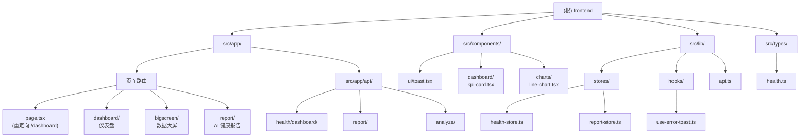

# CLAUDE.md — RHYTHMIND 律动前端

> **项目版本:** 0.1.9
> **最后扫描:** 2026-05-15T14:22:35+08:00
> **语言:** TypeScript
> **框架:** Next.js 16 (App Router) + React 19
> **包管理:** npm

---

## 变更记录 (Changelog)

- **2026-05-15** 首次 AI 上下文初始化，生成模块结构图与导航面包屑

---

## 项目愿景

RHYTHMIND 律动前端是 Next.js 16 多智能体健康管理平台的数据展示层，采用扁平化 UI 设计风格，主题色为青沐生命青绿色（#00C9A7）。支持仪表盘、数据大屏、AI 健康报告三大核心页面。

---

## 架构总览

### 项目结构图



---

## 模块索引

| 模块路径 | 职责 | 入口文件 | 关键文件 |
|---------|------|---------|---------|
| `app/dashboard` | 仪表盘页面 | `page.tsx` | KPI 卡片、折线图 |
| `app/bigscreen` | 数据大屏页面 | `page.tsx` | 6 KPI 网格、年度跑量图 |
| `app/report` | AI 健康报告 | `page.tsx` | Markdown 渲染、报告列表 |
| `app/api` | API 代理 | `health/dashboard/route.ts` 等 | 转发到后端 localhost:8888 |
| `components/charts` | 图表组件 | `line-chart.tsx` | ECharts 折线图 |
| `components/ui` | UI 组件 | `toast.tsx` | 全局错误提示 |
| `lib/stores` | Zustand 状态 | `health-store.ts`, `report-store.ts` | 健康数据/报告状态 |
| `lib/hooks` | Hook 工具 | `use-error-toast.ts` | 错误提示 Hook |
| `lib/api` | API 调用层 | `api.ts` | fetchWithAuth 封装 |
| `types` | TypeScript 类型 | `health.ts` | HealthData, Report 等 |

---

## 技术栈

| 技术 | 版本 | 用途 |
|------|------|------|
| Next.js | 16.2.6 | App Router 框架 |
| React | 19.2.4 | UI 库 |
| TypeScript | 5.x | 类型系统 |
| Zustand | 5.0.13 | 状态管理 |
| ECharts | 6.0.0 | 图表渲染 |
| Tailwind CSS | 4.x | 样式框架 |
| ESLint | 9.x | 代码检查 |

---

## 运行与开发

```bash
# 安装依赖
npm install

# 开发模式
npm run dev

# 构建生产版本
npm run build

# 代码检查
npm run lint
```

### 环境变量

| 变量 | 默认值 | 说明 |
|------|--------|------|
| `NEXT_PUBLIC_API_URL` | `http://localhost:8888` | 后端 API 地址 |

---

## 设计系统

### 主题色

```css
--primary: #00C9A7;     /* 青沐生命青绿色 */
--secondary: #00A99D;   /* 次要色 */
--accent: #00D4FF;     /* 强调色 */
--background: #111111; /* 深色背景 */
--surface: #1A1A1A;    /* 卡片背景 */
--surface-elevated: #222222; /* 悬停态 */
--border: #333333;      /* 边框 */
--success: #00C9A7;
--warning: #FFB800;
--error: #FF4757;
```

### 组件样式

- **扁平卡片**: `.card` 类，无阴影纯边框
- **KPI 卡片**: `.kpi-card` 类，左侧状态色条
- **按钮**: `.btn-primary` 类，青绿色填充

---

## 数据流

```
用户操作
   ↓
Zustand Store (health-store / report-store)
   ↓
API 层 (lib/api.ts) → fetchWithAuth
   ↓
后端 API (localhost:8888)
   ↓
组件渲染 (ECharts / KPI Card)
```

---

## 覆盖报告

| 指标 | 数值 |
|------|------|
| 估算总文件数 | ~25 |
| 已扫描文件数 | 18 |
| 覆盖百分比 | **72%** |
| 模块数量 | 10 |
| 已生成 CLAUDE.md | 1 (根级) |
| 导航面包屑 | 待生成 |

### 缺口清单

- ⚠️ `src/components/dashboard/` — 仅扫描 kpi-card.tsx
- ⚠️ API route 文件未找到实际路径（可能不存在或在其他位置）
- ⚠️ `src/lib/stores/` — 需生成模块级 CLAUDE.md
- ⚠️ `src/components/charts/` — 需生成模块级 CLAUDE.md
- ⚠️ `tests/` — 未发现测试目录

---

## 推荐下一步

1. 生成 `src/lib/stores/CLAUDE.md` — 详述 health-store 和 report-store 的接口与状态结构
2. 生成 `src/components/charts/CLAUDE.md` — 详述 LineChart 组件的 ECharts 配置
3. 扫描 `src/app/bigscreen/` — 为数据大屏页面生成独立模块文档
4. 确认 API route 文件实际路径
5. 如有测试需求，创建 `tests/` 目录及测试文件

---

## 数据大屏开发建议

根据当前 `bigscreen/page.tsx` 的结构，建议：

1. **增加更多图表类型** — 当前仅使用 LineChart，可添加：
   - 环形图（睡眠结构）
   - 柱状图（周/月跑量对比）
   - 雷达图（训练指标综合展示）

2. **响应式布局优化** — 当前使用固定 6 列网格，建议：
   - 大屏全屏自适应
   - 考虑旋转屏幕支持
   - 动态 KPI 数量适配

3. **实时数据更新** — 当前 useEffect 仅在挂载时获取一次数据，建议：
   - 添加 WebSocket 或 SSE 实时推送
   - 数据显示动画过渡

4. **ECharts 主题定制** — 当前 LineChart 已支持深色模式，可进一步：
   - 统一所有图表的调色板
   - 添加图表公共配置（tooltip、legend 等）