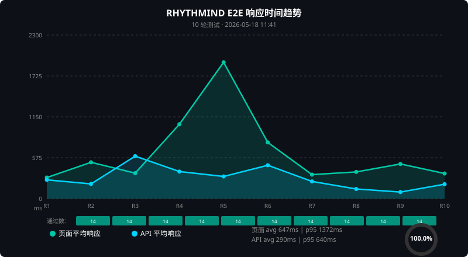

# RHYTHMIND E2E 测试报告

> 测试时间: 2026-05-18 11:41:36  
> 测试轮次: 10  
> 目标环境: https://aisport.tech/qm

## 总体结果

| 指标 | 值 |
|------|-----|
| 总测试数 | 140 |
| 通过数 | **140** |
| 失败数 | 0 |
| 通过率 | **100.0%** |
| 页面平均响应 | 647 ms |
| 页面 P95 | 1372 ms |
| API 平均响应 | 290 ms |
| API P95 | 640 ms |

## 测试用例明细

| # | 类别 | 用例 | 通过率 | 平均(ms) | 失败轮次 |
|---|------|------|--------|---------|---------|
| 1 | 页面 | 首页重定向 | ✅ 10/10 | 420 | - |
| 2 | 页面 | 仪表盘页面 | ✅ 10/10 | 1184 | - |
| 3 | 页面 | 数据大屏页面 | ✅ 10/10 | 420 | - |
| 4 | 页面 | 报告页面 | ✅ 10/10 | 528 | - |
| 5 | 页面 | 静态资源 JS | ✅ 10/10 | 681 | - |
| 6 | API | Dashboard API | ✅ 10/10 | 355 | - |
| 7 | API | Reports API | ✅ 10/10 | 225 | - |
| 8 | 数据完整性 | profile.vo2_max | ✅ 10/10 | 0 | - |
| 9 | 数据完整性 | profile.bmi | ✅ 10/10 | 0 | - |
| 10 | 数据完整性 | profile.weight_kg | ✅ 10/10 | 0 | - |
| 11 | 数据完整性 | profile.age | ✅ 10/10 | 0 | - |
| 12 | 数据完整性 | training.metrics | ✅ 10/10 | 0 | - |
| 13 | 数据完整性 | running.summary | ✅ 10/10 | 0 | - |
| 14 | 数据完整性 | sleep.summary | ✅ 10/10 | 0 | - |

## 性能趋势

