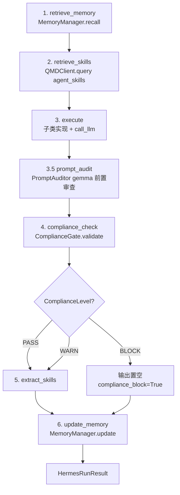
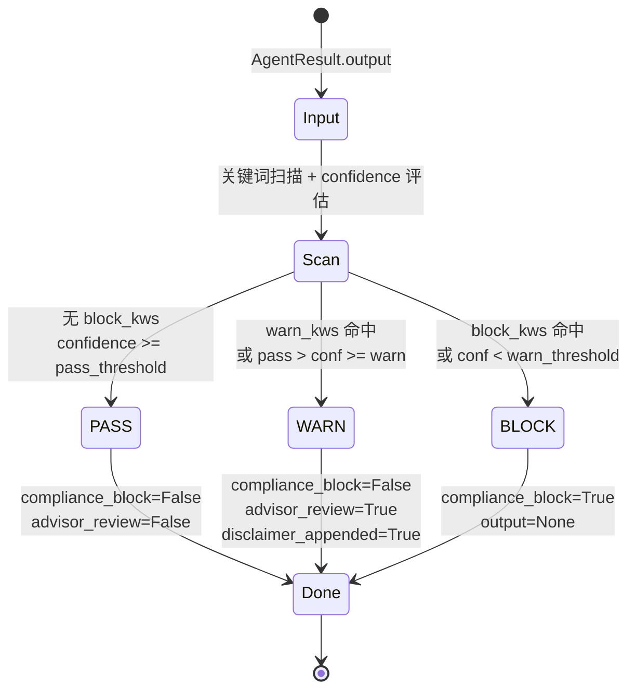

# rhythmind/core — Hermes 核心层

> `[根目录(../../CLAUDE.md) > **rhythmind** > **core**`
>
> **最后更新:** 2026-06-15T01:10:00+08:00（P3 ComplianceResult 解耦 + P1 MemoryManager 显式调用补强）

---

## 模块职责

Hermes Pattern v2 的核心实现，包含：

- **HermesBase**: 所有 Agent 的抽象基类（6 步执行循环）
- **MemoryManager**: 会话记忆管理（含 P1 修复的显式 `update()` 调用）
- **FactManager**: 健康知识图谱
- **SkillEngine**: 技能提取与复用
- **ComplianceGate / PromptAuditor**: 合规审查（双层防护，P3 阶段完成 `requires_human_review` → `compliance_block` + `advisor_review` 语义解耦）
- **QMDClient**: 本地语义搜索客户端
- **Redis 缓存层**: 装饰器缓存 + Session/Fact/Intent 缓存

---

## 入口与启动

- **Agent 基类**: `from rhythmind.core.hermes_base import HermesBase`
- **记忆管理**: `from rhythmind.core.memory import MemoryManager, init_db`
- **QMD 客户端**: `from rhythmind.core.qmd import QMDClient`
- **缓存**: `from rhythmind.core.cache import cache_async, SessionCache, FactCache, IntentCache, close_redis`
- **合规**: `from rhythmind.core.compliance import PromptAuditor, ComplianceGate, ComplianceResult, ComplianceLevel`

---

## 对外接口

### HermesBase (ABC)

```python
class HermesBase(ABC):
    def __init__(self, agent_name: str, user_id: str) -> None: ...
    async def run(self, ctx: AgentContext) -> HermesRunResult: ...
    async def execute(self, ctx, memory_ctx, skill_ctx) -> AgentResult: ...  # 抽象方法
    async def call_llm(self, messages, model, temperature, max_tokens, response_format) -> str: ...
    async def remember(self, key, value, mem_type) -> None: ...
    async def recall(self, query, top_k) -> list[dict]: ...
    async def search_knowledge(self, query, collection) -> list[dict]: ...
```

#### 六步执行循环（Hermes Pattern v2）



| 步 | 名称 | 失败处理 |
|----|------|---------|
| 1 | `retrieve_memory` | 召回失败静默降级为空上下文 |
| 2 | `retrieve_skills` | QMD 不可用时静默降级 |
| 3 | `execute` (abstract) | 子类负责异常处理 |
| 3.5 | `prompt_audit` (call_llm 内) | gemma-4 不可用 → AuditResult.fallback=PASS |
| 4 | `compliance_check` | BLOCK → 输出置空 + `compliance_block=True` |
| 5 | `extract_skills` | 沉淀经验到 QMD |
| 6 | `update_memory` | 写库失败仅 warning 日志，不阻断 |

> **P1 修复**：`MetricsProcessor` 不继承 `HermesBase`，所以 `compliance.memory_updates` 不会被步骤 6 自动消费。修复方式：`metrics_agent.py` 末尾显式调用 `MemoryManager.update(compliance.memory_updates)`，try/except 降级为 warning 日志，不阻断主流程。

### MemoryManager

```python
class MemoryManager:
    def __init__(self, user_id: str, agent: str) -> None: ...
    async def recall(self, task_type, mem_types, limit) -> MemoryRecallResult: ...
    async def write(self, key, value, mem_type, confidence, ttl_hours, tags) -> None: ...
    async def update(self, updates: dict) -> None: ...  # 批量更新 memory_updates（P1 修复后由 MetricsProcessor 显式调用）
    async def delete(self, key) -> None: ...
    async def purge_expired(self) -> int: ...
```

### FactManager

```python
class FactManager:
    def __init__(self, user_id: str) -> None: ...
    async def write_fact(self, subject, predicate, object_value, source, confidence, valid_from) -> HealthFact: ...
    async def write_fact_additive(self, ...) -> HealthFact: ...
    async def invalidate_fact(self, fact_id) -> bool: ...
    async def invalidate_by_subject(self, subject, predicate) -> int: ...
    async def query_current(self, subject, predicate) -> list[HealthFact]: ...
    async def query_history(self, subject, predicate, limit) -> list[HealthFact]: ...
    async def get_all_current(self) -> list[HealthFact]: ...
    async def get_current_goal(self) -> dict | None: ...
    async def get_current_injuries(self) -> list[dict]: ...
```

### QMDClient

```python
class QMDClient:
    def __init__(self, base_url, timeout) -> None: ...
    async def query(self, collection, query, user_ns, top_k, filters) -> list[dict]: ...
    async def upsert(self, collection, doc_id, content, metadata, user_ns) -> bool: ...
    async def index_skill(self, agent, skill_content, task_type) -> bool: ...
    async def index_user_memory(self, user_id, key, content) -> bool: ...
    async def query_user_memory(self, user_id, query, top_k) -> list[dict]: ...
```

### ComplianceGate

```python
class ComplianceGate:
    def __init__(self, rules) -> None: ...
    def validate(self, result, confidence_override) -> ComplianceResult: ...
    def pre_check(self, raw_input) -> bool: ...
```

#### 三级输出分级（状态机）



| 分级 | 触发条件 | `compliance_block` | `advisor_review` | 输出 |
|------|---------|---------------------|-------------------|------|
| **PASS** | 无 block 关键词 ∧ confidence ≥ pass_threshold | False | False | 原样输出 |
| **WARN** | warn 关键词命中 ∨ pass_threshold > confidence ≥ warn_threshold | False | True | 追加免责声明 |
| **BLOCK** | block 关键词命中 ∨ confidence < warn_threshold | True | False | output=None |

### PromptAuditor

```python
class PromptAuditor:
    def __init__(self, model_spec) -> None: ...
    async def audit(self, messages) -> AuditResult: ...
```

---

## 关键依赖与配置

- **合规**: `ComplianceGate` + `PromptAuditor`（双层防护：前置 prompt 审查 + 后置输出分级）
- **QMD**: `qmd_url`, `qmd_timeout`, `qmd_top_k`
- **缓存**: `redis_url`, Redis 异步连接单例，故障时静默降级
- **模型**: 通过 `AdapterRouter` 调用 LLM

---

## 数据模型

### AgentContext

```python
@dataclass
class AgentContext:
    user_id: str
    session_id: str
    task_type: str
    input_data: dict[str, Any]
    confidence_threshold: float = 0.75
    metadata: dict[str, Any] = field(default_factory=dict)
```

### AgentResult

```python
@dataclass
class AgentResult:
    output: Any
    confidence: float
    skill_candidates: list[str] = field(default_factory=list)
    memory_updates: dict[str, Any] = field(default_factory=dict)
    requires_human_review: bool = False  # 保留字段，向后兼容；新代码建议消费 ComplianceResult 的细粒度信号
```

### HermesRunResult

```python
@dataclass
class HermesRunResult:
    compliance: ComplianceResult
    agent: str
    user_id: str
    task_type: str
    latency_ms: float
    audit_result: AuditResult | None = None
    output: Any = field(init=False)
    success: bool = field(init=False)
```

### ComplianceResult（P3 解耦后）

```python
@dataclass
class ComplianceResult:
    level: ComplianceLevel  # PASS / WARN / BLOCK
    output: Any             # BLOCK 时为 None
    confidence: float
    skill_candidates: list[str]
    memory_updates: dict[str, Any]
    # ── P3 解耦：拆分 requires_human_review 为两个独立信号 ──
    #   compliance_block — 合规门禁拦截（高风险，建议拒绝）
    #   advisor_review   — Agent/Advisor 主动建议复核（中等风险）
    compliance_block: bool = False       # 来自 BLOCK 路径（高风险）
    advisor_review: bool = False         # 来自 raw advisor 路径（中等风险）
    triggered_keywords: list[str] = field(default_factory=list)
    disclaimer_appended: bool = False

    @property
    def requires_human_review(self) -> bool:
        """向后兼容属性：任一信号触发即 True。

        下游消费者可继续使用此字段以保持兼容。
        新代码应直接消费 compliance_block / advisor_review 以区分根因。
        """
        return self.compliance_block or self.advisor_review
```

**字段语义矩阵**（P3 解耦核心）：

| 字段 | 触发源 | 风险等级 | 典型消费方 |
|------|--------|----------|------------|
| `compliance_block` | BLOCK 路径（关键词 ∨ 低 confidence） | 高 | CoachAgent 拒绝继续 |
| `advisor_review` | raw advisor 路径（关键词 ∨ 主动标记） | 中 | MedicalAdvisor 给出复核建议 |
| `requires_human_review` | OR 派生（`compliance_block ∨ advisor_review`） | — | 旧代码兼容 |

**构造点迁移**（P3 修复）：
- `gate.py:113` — BLOCK 分支设 `compliance_block=True`
- `hermes_base.py:251` — 合并逻辑拆为两条独立设置
- `hermes_base.py:256` — raw → `advisor_review=True`
- `hermes_base.py:417` — SwarmDataCoach 构造点迁移
- `metrics_agent.py:223` — MetricsProcessor 直接构造用 `advisor_review=has_critical`

### AuditResult

```python
@dataclass
class AuditResult:
    level: AuditLevel
    overall_score: float
    medical_risk: float
    privacy_risk: float
    hallucination_risk: float
    reason: str
    extra_constraints: list[str]
    auditor_available: bool
```

### MemoryEntry / MemoryRecallResult

```python
class MemoryEntry(BaseModel):
    namespace: str
    key: str
    value: Any
    mem_type: MemoryType
    confidence: float
    created_at: datetime
    updated_at: datetime
    expires_at: datetime | None
    tags: list[str]

class MemoryRecallResult(BaseModel):
    entries: list[MemoryEntry]
    total: int
```

### HealthFact

```python
class HealthFact(Base):
    id: int
    user_id: str
    subject: str
    predicate: str
    object_json: Any
    source: str
    confidence: float
    valid_from: datetime
    valid_until: datetime | None
    created_at: datetime
    @property
    def is_current(self) -> bool: ...
```

---

## 测试与质量

- 测试目录：`tests/unit/` 下有 core 相关测试
  - `test_compliance_gate.py` — 5 用例覆盖 `TestComplianceResultDecoupling`（P3 新增）
  - `test_hermes_base.py` — HermesBase 6 步循环单测
  - `test_memory_*` — MemoryManager CRUD
- 代码风格：`ruff check src/rhythmind/core/`
- 回归基线：**607 passed + 4 skipped + 0 failed**（2026-06-15 全量）

---

## 常见问题 (FAQ)

**Q: Hermes Pattern 的六步循环是什么？**  
A: 1) retrieve_memory → 2) retrieve_skills → 3) execute (call_llm) → 3.5) prompt_audit → 4) compliance_check → 5) extract_skills → 6) update_memory

**Q: 合规审查失败会怎样？**  
A: 抛出 `ComplianceBlockedError`，由 `execute()` 捕获并返回降级 `AgentResult`，或上浮由 `run()` 统一处理。BLOCK 路径下 `compliance_block=True` + `output=None`。

**Q: QMD 不可用时是否影响主流程？**  
A: QMD 搜索失败时静默降级，不阻断 Agent 执行。

**Q: `requires_human_review` 与 `compliance_block` / `advisor_review` 关系？（P3 解耦）**  
A: `requires_human_review` 是 `@property`，等价于 `compliance_block or advisor_review`（向后兼容）。新代码应直接消费 `compliance_block` / `advisor_review`：
- `compliance_block=True` → 合规门禁拦截，建议直接拒绝
- `advisor_review=True` → Agent 主动建议人工复核（医疗风险等中等风险）

**Q: MetricsProcessor 为什么显式调用 `MemoryManager.update()`？（P1 修复）**  
A: `MetricsProcessor` 不继承 `HermesBase`，因此六步循环的步骤 6 不会自动消费 `compliance.memory_updates`。修复方式是在 `metrics_agent.py` 末尾显式调用 `MemoryManager.update(compliance.memory_updates)`，try/except 降级为 warning 日志，不阻断主流程。

---

## 相关文件清单

```
src/rhythmind/core/
├── __init__.py
├── hermes_base.py          # Agent 基类（6 步循环 + 步骤 4 P3 解耦后合并逻辑）
├── memory/
│   ├── __init__.py        # 公开 API: MemoryManager, FactManager, HealthFact, MemoryEntry
│   ├── manager.py         # MemoryManager + init_db（含 P1 update() 批量接口）
│   ├── models.py          # AgentMemory, SkillRecord, HealthFact ORM 模型
│   ├── types.py           # MemoryEntry, MemoryRecallResult, MemoryType
│   └── fact_manager.py   # FactManager
├── skill/
│   ├── __init__.py
│   ├── engine.py          # SkillEngine
│   └── extractor.py       # SkillExtractor
├── compliance/
│   ├── __init__.py
│   ├── gate.py            # ComplianceGate（三级输出分级 + P3 compliance_block/advisor_review 字段）
│   ├── prompt_auditor.py  # PromptAuditor（gemma 前置审查）
│   └── keywords.py        # 关键词规则加载
└── qmd/
    ├── __init__.py
    └── client.py          # QMDClient
├── cache/
    └── __init__.py        # Redis 缓存层: cache_async, SessionCache, FactCache, IntentCache
```

---

## 变更记录 (Changelog)

- **2026-06-15** P3 ComplianceResult 字段语义解耦 + P1 MemoryManager.update 显式调用补强：① `ComplianceResult` 新增 `compliance_block`（合规门禁拦截）+ `advisor_review`（Agent 主动建议复核）两个独立字段 ② `requires_human_review` 改为 `@property`（OR 派生，向后兼容）③ `gate.py:113` BLOCK 路径设 `compliance_block=True` ④ `hermes_base.py:251-256` 合并逻辑拆为两条独立设置 ⑤ `hermes_base.py:417` + `swarm_data_coach.py:493/539` 构造点迁移 ⑥ `metrics_agent.py:223` MetricsProcessor 直接构造用 `advisor_review=has_critical` ⑦ 新增 6 步循环 Mermaid 流程图 + ComplianceGate 三级状态机图 ⑧ 字段语义矩阵 + 构造点迁移表 ⑨ 新增 P1 修复 FAQ
- **2026-05-18** 增量更新：新增 cache 子模块（Redis 缓存层：装饰器缓存、Session/Fact/Intent 缓存）
- **2026-05-12** 完整扫描完成，新增所有子模块详细接口和数据模型
- **2026-05-12** 首次 AI 上下文初始化
